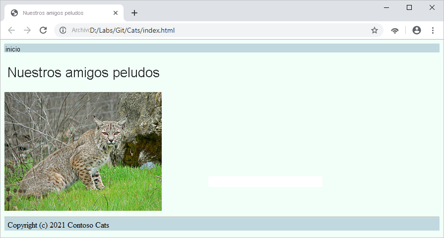
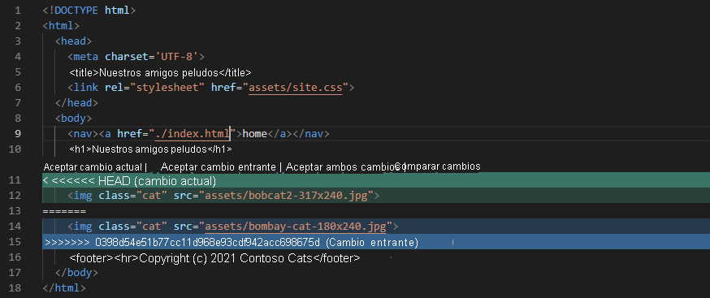

## Edición de código mediante creación de ramas y combinación en Git.md
___
## Introducción

Imagine que es un nuevo desarrollador de software en una empresa que escribe software de aviónica para líneas aéreas comerciales. El control de calidad es crítico y los desarrolladores trabajan en equipos pequeños que usan Git para el control de versiones. Ya sabe algo sobre Git. Lo ha usado para realizar un seguimiento de los cambios, corregir errores y colaborar con otros desarrolladores a través de un repositorio compartido y solicitudes de incorporación de cambios. Sin embargo, sabe que Git todavía tiene mucho más que ofrecer, y eso le entusiasma.

Ya ha creado un pequeño sitio web que usted y sus amigos pueden usar para practicar con Git compartiendo fotografías de sus gatos. Ha reclutado a un par de amigos que son desarrolladores de software para que le ayuden.

A medida que progresa el proyecto, desea facilitar la colaboración con sus amigos, para poder trabajar en las características del sitio web sin conflictos ni esfuerzos en vano.

En este módulo, aprenderá qué ramas hay en Git, cómo usarlas para el desarrollo y cómo combinarlas, incluida la resolución de los conflictos de las combinaciones.

#### Objetivos de aprendizaje
En este módulo, aprenderá a realizar las tareas siguientes:

  * Trabajar con las ramas en Git
  * Crear ramas y cambiar de una a otra
  * Combinar ramas
  * Más información sobre técnicas básicas para resolver conflictos de combinación

#### Requisitos previos
Para trabajar en este módulo, debe tener conocimientos básicos de cómo trabajar con Git, entre los que se incluyen:

  * Términos como repositorio, árbol de trabajo e índice
  * Creación de repositorios
  * Almacenamiento provisional y confirmación de cambios
  * Restablecimiento y reversión de errores simples
  * Clonación de repositorios
  * Solicitudes de incorporación de cambios
  * Guardado provisional de cambios
  * Inserción de cambios y actualización del repositorio mediante extracción

___

## Ramas en Git

Es un desarrollador web que intenta aprender más cosas sobre Git por motivos laborales. Ha creado un sitio web HTML y CSS sencillo que presenta fotos de gatos para poner en práctica sus aptitudes de Git y ha trabajado en él con sus amigos, Alice y Bob. 

A medida que el proyecto avanza, se da cuenta de que quiere que todos puedan trabajar en más de una tarea a la vez sin interponerse en la forma de trabajar de otra persona. Necesita mantener por separado el trabajo de todos para que el nuevo desarrollo no interfiera con las correcciones de errores existentes. En Git, las *ramas* facilitan este tipo de colaboración.

El trabajo que se hace en una rama no se tiene que compartir, y tampoco interfiere con el trabajo realizado en otras ramas. Las ramas le permiten mantener las confirmaciones relacionadas con cada tema juntas y aisladas de otro trabajo, por lo que los cambios realizados en un tema son fáciles de revisar y supervisar.

El desarrollo de software moderno se realiza casi por completo en ramas. El objetivo es mantener limpia la rama principal hasta que el trabajo esté listo para su inserción en el repositorio. Después, inserte los cambios en la rama principal, o mejor aún, envíe una solicitud de incorporación de cambios para fusionar los cambios.

Una ventaja de Git con respecto a los sistemas de control de versiones (VCS) anteriores es que, con Git, la creación de una rama es muy rápida; equivale a escribir un hash de 40 caracteres en un archivo en `.git/heads`. La conmutación de ramas también es rápida, ya que Git almacena archivos completos y los descomprime en lugar de intentar reconstruirlos a partir de listas de cambios. La combinación en Git no es tan simple, pero es sencilla y a menudo totalmente automática.

Veamos qué son las ramas, cómo se usan y cómo funcionan.

#### Estructura y nomenclatura de las ramas
Una *rama* es simplemente una cadena de confirmaciones que se ramifica a partir de la línea principal de desarrollo, como una rama de un árbol.

Si va a cambiar a Git desde otro VCS, es posible que esté acostumbrado a una terminología algo distinta. La subversión del VCS nombra su rama predeterminada como `trunk`, mientras que Git la denomina `master`. Puede cambiar el nombre de la rama predeterminada de la misma forma que puede hacerlo con cualquier otra rama. En este módulo, la rama predeterminada se denomina `main`.

Normalmente, una rama comienza con una confirmación en la rama predeterminada; en este caso, en `main`. A medida que se agregan confirmaciones, la rama desarrolla una cadena de historial independiente. Finalmente, los cambios de la rama se vuelven a combinar en `main`. En este módulo, aprenderá a realizar confirmaciones en una rama y a combinarlas en la rama `main`.

Supongamos que crea una rama a partir de la rama `main`. Aquí se muestra cómo visualizar lo que sucede:


Cada letra mayúscula del diagrama representa una confirmación. Las ramas reciben nombres tales como `add-authentication` y `fix-css-bug`, y pueden tener sus propias ramas. El objetivo final es dejar que los desarrolladores hagan lo que tienen que hacer sin interferir unos con otros y terminar con una rama principal que represente los mejores esfuerzos de todos los implicados.

#### Creación y modificación de ramas (rama de Git y desprotección de Git)

Una razón común para crear una rama es realizar cambios en una característica existente. Una rama con este fin se denominaría habitualmente *rama puntual* o *rama de características*.

Puede crear una rama con el comando `git branch`. Cambie entre las ramas con el comando `git checkout`.

Ha identificado `checkout` como una forma de reemplazar archivos en el árbol de trabajo obteniéndolos del índice. Sin rutas de acceso en la lista de argumentos, `checkout` actualiza todo lo que hay en el árbol de trabajo y el índice para que coincida con la confirmación especificada (en este caso, el encabezado de la rama).

#### Combinación de ramas (combinación de Git)
Una vez que haya finalizado algún trabajo en una rama, quizá una característica o una corrección de errores, querrá *combinar* la rama de nuevo con la rama principal. Puede usar el comando `git merge` para combinar una rama específica con la rama actual.

Por ejemplo, si estuviera trabajando en una rama llamada *my-feature*, el flujo de trabajo sería similar al del siguiente ejemplo:
``` bash
# Switch back to the main branch
git checkout main

# Merge my-feature branch into main
git merge my-feature
```

Después de usar estos comandos y resolver los *conflictos de combinación* (los describiremos más adelante en este módulo), todos los cambios de la rama `my-feature` se encontrarían en `main`.

___

## Ejercicio: Creación de una rama como Alice

Su amiga desarrolladora Alice desea agregar algunos estilos CSS para dar estilo a las fotos de gatos del sitio web. Alice desea realizar este trabajo en su propia rama.

#### Configurar
Para que podamos asumir el rol de Alice, debe hacer algo de trabajo para configurar un repositorio vacío que todos compartan y, después, agregar algunos archivos. 

Git ya se ha instalado automáticamente en Azure Cloud Shell, por lo que podemos usar Git en Cloud Shell, a la derecha.

#### Creación de un repositorio vacío compartido

1. Cree un directorio denominado `Shared.git` para que contenga el repositorio vacío:
``` bash
mkdir Shared.git
cd Shared.git
```

2. Ahora, ejecute el comando siguiente para crear un repositorio vacío en el directorio compartido: 
``` bash
git init --bare
```

3. Establezca el nombre de la rama predeterminada del nuevo repositorio. Para realizar este paso, puede cambiar la rama `HEAD` para que apunte a otra rama; en este caso, la rama `main`:
``` bash
git symbolic-ref HEAD refs/heads/main
```

#### Clonación del repositorio compartido para Bob

1. Suba un nivel a partir de este directorio y cree un directorio para que Bob almacene su repositorio:
``` bash
cd ..
mkdir Bob
```

2. Clone y configure el repositorio de Bob:
``` bash
cd Bob
git clone ../Shared.git .
git config user.name Bob
git config user.email bob@contoso.com
git symbolic-ref HEAD refs/heads/main
```
 
    Nota:
    Como quiere empezar con la rama predeterminada de `main`, debe cambiar HEAD para que apunte a `refs/heads/main`en lugar de `refs/heads/master`, que es el nombre de la rama predeterminada.

#### Incorporación de archivos base

Como paso final de configuración, se agregarán los archivos de sitio web base y se insertarán en el repositorio compartido. En el caso de estos comandos, todavía estamos trabajando en el directorio *Bob*.

1. Cree algunos archivos mediante el comando `touch` de Linux, agréguelos al "stage" y confírmelos mediante Git:
``` bash
touch index.html
mkdir Assets
touch Assets/site.css
git add .
git commit -m "Create empty index.html and site.css files"
```

2. Ahora agregue HTML al archivo con el editor de código de Cloud Shell. Puede abrir el editor mediante la ejecución del comando `code`. Abra *index.html* en el editor en línea; para ello, introduzca `code index.html` en el símbolo del sistema del terminal:
``` bash
code index.html
```

3. Pegue este código HTML: 
``` html
<!DOCTYPE html>
<html>
  <head>
    <meta charset='UTF-8'>
    <title>Our Feline Friends</title>
    <link rel="stylesheet" href="CSS/site.css">
  </head>
  <body>
    <nav><a href="./index.html">home</a></nav>
    <h1>Our Feline Friends</h1>
    <p>Eventually we will put cat pictures here.</p>
    <footer><hr>Copyright (c) 2021 Contoso Cats</footer>
  </body>
</html>
```

4. Guarde el archivo y cierre el editor. Puede seleccionar los puntos suspensivos "…" de la esquina derecha del editor o usar el método abreviado de teclado (CTRL+S en Windows y Linux, o bien Cmd+S en macOS).

5. Cambie al directorio Assets (Recursos) y abra site.css en el editor:
``` bash
cd Assets
code site.css
```

6. Agregue el siguiente CSS al archivo:
``` css
h1, h2, h3, h4, h5, h6 { font-family: sans-serif; }
body { font-family: serif; background-color: #F0FFF8; }
nav, footer { background-color: #C0D8DF; }
```
Guarde el archivo y cierre el editor.


7. Vuelva al directorio Bob y confirme de nuevo: 
``` bash
cd ..
git add .
git commit -m "Add simple HTML and stylesheet"
git push --set-upstream origin main
```

     Nota
     Como se va a usar otro nombre de rama predeterminado, debe indicarle a Git que asocie la rama principal a la rama principal del repositorio de origen.

8. Compruebe los resultados. Si ve una advertencia similar a la de este ejemplo, no se preocupe. Esta advertencia simplemente informa a los usuarios de un cambio en los comportamientos predeterminados de Git. 
``` bash
warning: push.default is unset; its implicit value has changed in
Git 2.0 from 'matching' to 'simple'. To squelch this message
and maintain the traditional behavior, use:

  git config --global push.default matching

To squelch this message and adopt the new behavior now, run:

  git config --global push.default simple

When push.default is set to 'matching', git will push local branches
to the remote branches that already exist with the same name.

Since Git 2.0, Git defaults to the more conservative 'simple'
behavior, which only pushes the current branch to the corresponding
remote branch that 'git pull' uses to update the current branch.

See 'git help config' and search for 'push.default' for further information.
(the 'simple' mode was introduced in Git 1.7.11. Use the similar mode
'current' instead of 'simple' if you sometimes use older versions of Git)
```
Si quiere asegurarse de que no vuelve a ver esta advertencia, puede ejecutar este comando:
``` bash
git config --global push.default simple
```

9. Compruebe la salida de este indicador de éxito: 
``` bash
Counting objects: 9, done.
Delta compression using up to 2 threads.
Compressing objects: 100% (6/6), done.
Writing objects: 100% (9/9), 953 bytes | 953.00 KiB/s, done.
Total 9 (delta 0), reused 0 (delta 0)
To ../Shared.git
 * [new branch]      main -> main
```


#### Creación de una rama para Alice

Alice quiere crear una rama puntual denominada `add-style` para realizar su trabajo. Vamos a asumir el rol de Alice y, después, crearemos la rama y agregaremos código a esta rama.

1. Suba un nivel a partir de este directorio y cree un directorio para la copia del repositorio de Alice:
``` bash
cd ..
mkdir Alice
```

2. Clone el repositorio de Alice y, a continuación, configúrelo: 
``` bash
cd Alice
git clone ../Shared.git .
git config user.name Alice
git config user.email alice@contoso.com
```

3. Ahora tiene una copia actual del repositorio. Puede enumerar el contenido del archivo y ejecutar `git status` para confirmar el estado del repositorio. 
``` bash
ls
git status
```

4. Ejecute el comando `git branch` para crear una rama denominada `add-style`. Luego, ejecute el comando `git checkout` para cambiar a esa rama (de este modo, la convierte en la *rama actual*).
``` bash
git branch add-style
git checkout add-style
```

5. En el directorio *Alice/Assets* (Alice/Recursos), abra site.css. Agregue la siguiente definición de clase CSS al final del archivo: 
``` css
.cat { max-width: 40%; padding: 5 }
```
Guarde los cambios en el archivo y cierre el editor.


6. Confirme el cambio: 
``` bash
git commit -a -m "Add style for cat pictures"
```

7. En este momento, Alice quiere poner su estilo a disposición de todos los demás, para que cambien a `main` de nuevo y realicen una incorporación de cambios por si alguna otra persona ha realizado cambios: 
``` bash
git checkout main
git pull
```

8. La salida indica que la rama `main` está actualizada (es decir, `main` del equipo de Alice coincide con `main` en el repositorio compartido). Por tanto, Alice combina la rama `add-style` con la rama `main` mediante la ejecución del comando `git merge --ff-only` para realizar una combinación de *avance rápido*. Luego, Alice inserta la `main` de su repositorio en el compartido. 
``` bash
git merge --ff-only add-style
git push
```
En este caso, la combinación de avance rápido no era estrictamente necesaria porque la rama `main` no tenía ningún cambio y Git habría combinado los cambios de todos modos. Sin embargo, usar la marca `--ff only` es una buena práctica porque se produce un error en una combinación de `--ff-only` si `main` ha cambiado.

___

## Ejercicio: Combinación de la rama de Bob

Aunque Alice está trabajando en CSS para el sitio web, Bob está trabajando en casa, completamente ajeno al trabajo que está realizando Alice. No hay problema con esta disposición porque ambos usan ramas. Bob decide realizar algunos cambios por su cuenta.

#### Creación de una rama para Bob

1. Vuelva al directorio *Bob* y ejecute el comando siguiente para crear una rama denominada `add-cat`. Use la popular opción `checkout -b` para crear la rama y cambiar a ella con un solo comando.
``` bash
cd ../Bob
git checkout -b add-cat
```


2. Descargue el archivo ZIP que contiene *[algunos recursos del sitio web][5]*. A continuación, descomprima los archivos de recursos: 
[5]: https://github.com/MicrosoftDocs/mslearn-branch-merge-git/raw/main/git-resources.zip
``` bash
wget https://github.com/MicrosoftDocs/mslearn-branch-merge-git/raw/main/git-resources.zip
unzip git-resources.zip
```

3. Ahora, mueva el archivo *bobcat2-317x240.jpg* al directorio Assets (Recursos) de Bob. Elimine los demás archivos. Descargará los archivos y los volverá a usar más adelante.
``` bash
mv bobcat2-317x240.jpg Assets/bobcat2-317x240.jpg
rm git-resources.zip
rm bombay-cat-180x240.jpg
```

4. A continuación, abra el archivo *index.html* y reemplace la línea que dice "Eventually we will put cat pictures here" (al final se incluirán aquí las imágenes de gatos) por la siguiente línea:
``` html

```

5. Guarde el archivo y cierre el editor.


6. Ha realizado dos cambios en la rama `add-cat` de Bob: se ha agregado un archivo y se ha modificado otro. Ejecute `git status` para volver a comprobar los cambios: 
``` bash
git status
```

7. Después, ejecute los comandos siguientes para agregar el nuevo archivo del directorio *Assets* (Recursos) al índice y confirmar todos los cambios:
``` bash
git add .
git commit -a -m "Add picture of Bob's cat"
```

8. Bob ahora realiza la misma acción que antes hizo Alice. Bob vuelve a cambiar a la rama `main` y ejecuta una incorporación de cambios para ver si ha cambiado algo:
``` bash
git checkout main
git pull
```

9. Compruebe los resultados. Esta vez, el resultado indica que los cambios se *han realizado* en la rama `main` en el repositorio compartido (el resultado de las inserciones de Alice). También indica que el cambio extraído de `main` en el repositorio compartido se ha combinado con `main` en el repositorio de Bob:
``` bash
remote: Counting objects: 4, done.
remote: Compressing objects: 100% (3/3), done.
remote: Total 4 (delta 1), reused 0 (delta 0)
Unpacking objects: 100% (4/4), done.
From D:/Labs/Git/Bob/../Shared
   e81ae09..1d2bfea  main     -> origin/main
Updating e81ae09..1d2bfea
Fast-forward
 Assets/site.css | 3 ++-
 1 file changed, 2 insertions(+), 1 deletion(-)
```

10. A continuación, Bob combina su rama en la rama para que de su repositorio tenga sus cambios `main` y `main` los de Alice. A continuación, Bob envía los cambios de `main` del equipo de la rama `main` del repositorio compartido:
``` bash
git merge add-cat --no-edit
git push
```
Bob no usó la marca `--ff-only` porque sabían que `main` había cambiado. Una combinación de solo avance rápido habría producido un error.

#### Sincronización de los repositorios

En este momento, Bob tiene un repositorio actualizado, pero Alice no. Alice tiene que ejecutar `git pull` en el repositorio compartido para asegurarse de que tiene la versión óptima y más reciente del sitio.

Ejecute los comandos siguientes para sincronizar el repositorio de Alice con el repositorio compartido:
``` bash
cd ../Alice
git pull
```

Tómese unos minutos para comprobar que el repositorio de Alice y el repositorio de Bob están sincronizados. Cada repositorio debe tener un archivo JPG en el directorio *Assets* (Recursos) y un elemento `` declarado en el archivo *index.html*. El archivo site.css de la carpeta Assets (Recursos) de cada repositorio debe contener una línea que defina una hoja de estilo CSS llamada cat. Alice agregó este estilo cuando realizó los cambios.

Si abre *index.html* en un explorador, verá la imagen siguiente:



En la lección siguiente, aprenderá a resolver conflictos de combinación, los cuales se producen cuando se superponen los cambios realizados por dos o más desarrolladores.

___

## Ejercicio: Resolución de conflictos de combinación

A veces, independientemente de lo bien que lo planee todo, las cosas salen mal. Imagine que dos desarrolladores están trabajando en el mismo archivo del proyecto al mismo tiempo. El primer desarrollador envía sus cambios a la rama `main` del repositorio del proyecto sin ningún problema. Cuando el segundo desarrollador intenta enviar los cambios, Git indica que hay un *conflicto de combinación*. El archivo que el segundo desarrollador está intentando modificar ya no está actualizado con los cambios o la versión de archivo más recientes. La versión de archivo debe estar actualizada antes de que se puedan combinar los cambios del segundo desarrollador. Una de las principales preocupaciones de los desarrolladores que usan el control de versiones es un conflicto de combinación.

Pueden producirse conflictos como este, por lo que debe saber cómo tratarlos. La buena noticia es que Git ofrece soluciones para tratar los conflictos de combinación. 

#### Creación de ramas para Alice y Bob

Comencemos por crear una rama para Alice y otra para Bob. Ambos amigos desarrolladores están actualizando los archivos del repositorio del proyecto al mismo tiempo. No son conscientes de los cambios que realiza el otro porque están realizando las actualizaciones en sus ramas locales.

1. Asegúrese de que se encuentra en el directorio *Alice* y, a continuación, cree una rama denominada `add-cat` para que Alice trabaje en:
``` bash
git checkout -b add-cat
```

2. Cambie al directorio *Bob* y, después, cree una rama denominada `style-cat` para que Bob trabaje en:
``` bash
cd ../Bob
git checkout -b style-cat
```
Ahora vamos a realizar algunos cambios en las ramas.

#### Realización de un cambio como Alice

Para empezar, suponga que tiene el rol de Alice y realice un cambio en la página principal del sitio web. Reemplace la imagen del gato de Bob por una fotografía del de Alice.

1. Vuelva a cambiar al directorio *Alice*:
``` bash
cd ../Alice
```

2. Si no ha descargado anteriormente los recursos, descargue el archivo ZIP que contiene *[los recursos que complementan esta lección][6]*. Descomprima los archivos de recursos:

[6]: https://github.com/MicrosoftDocs/mslearn-branch-merge-git/raw/main/git-resources.zip

``` bash
wget https://github.com/MicrosoftDocs/mslearn-branch-merge-git/raw/main/git-resources.zip
unzip git-resources.zip
```

3. Mueva el archivo *bombay-cat-180x240.jpg* al directorio Assets (Recursos) de Alice y elimine los demás archivos:
``` bash
mv bombay-cat-180x240.jpg Assets/bombay-cat-180x240.jpg
rm git-resources.zip
rm bobcat2-317x240.jpg
```

4. Abra el archivo *index.html* y, a continuación, reemplace esta instrucción (que usa una de las imágenes del gato de Bob):
``` html

```
Con esta instrucción (que usa una de las imágenes del gato de Alice):
``` html

```

5. Guarde el archivo y cierre el editor.

6. Ahora, ejecute los siguientes comandos de Git para enviar los cambios al repositorio del proyecto. En primer lugar, vamos a agregar las confirmaciones realizadas en la carpeta *Assets* (Recursos). Después, volveremos a la rama `main` y ejecutaremos *git pull* para asegurarnos de que no haya cambiado nada. Por último, vamos a combinar la rama local `add-cat` con la rama `main` y, después, enviaremos los cambios al repositorio.
``` bash
git add Assets
git commit -a -m "Add picture of Alice's cat"
git checkout main
git pull
git merge --ff-only add-cat
git push
```
Por último, es necesario confirmar que el envío de cambios se ha realizado correctamente.


#### Realización de un cambio como Bob

Sin saber lo que está haciendo Alice, Bob observa que el último envío de cambios de Alice ha agregado un estilo CSS denominado `cats` al archivo *site.css* para el repositorio. Por tanto, Bob decide aplicar esa clase a la imagen de su gato.

1. Vuelva al directorio *Bob*: 
``` bash
cd ../Bob
```

2. Abra el archivo *index.html* . Reemplace la instrucción que usa la imagen del gato de Bob por la siguiente instrucción que agrega un atributo `class="cat"` al elemento ``:
``` html

```

3. Guarde el archivo y cierre el editor.


4. Ahora, ejecute los siguientes comandos de Git para sincronizar los cambios en el repositorio del proyecto, como hizo para las actualizaciones en el repositorio de Alice. Confirme el cambio, cambie a la rama `main`, ejecute `git pull` y, a continuación, combine el cambio de estilo:
``` bash
git commit -a -m "Style Bob's cat"
git checkout main
git pull
git merge style-cat
```
Y ahí está: *el temido conflicto de combinación*. Dos personas han cambiado la misma línea en el mismo archivo. Git detecta el conflicto y notifica un error de combinación automática. Git no tiene forma de saber si el atributo `src` del elemento `` debe hacer referencia a los archivos *bobcat2-317x240.jpg* o *bombay-cat-180x240.jpg*.
Resultado:
``` bash
Auto-merging index.html
CONFLICT (content): Merge conflict in index.html
Automatic merge failed; fix conflicts and then commit the result.
```
La salida de Git identifica el archivo *index.html* como origen del conflicto.

La pregunta ahora es: ¿Qué puede hacer Bob?

#### Resolución del conflicto de combinación

Bob tiene pocas opciones en este momento. Bob puede realizar una de estas acciones:

   - Ejecute el comando `git merge --abort` para restaurar la rama `main` a su estado anterior a la combinación intentada. Ejecute el comando `git pull` para obtener los cambios de Alice. A continuación, cree una rama, realice los cambios y combine su rama con la rama `main`. Por último, envían los cambios.
   - Ejecute el comando `git reset --hard` para volver a la ubicación en la que estaban antes de que iniciaran la combinación.
   - Resuelva el conflicto manualmente mediante la información que Git inserta en los archivos afectados.

Los desarrolladores parecen preferir la última opción. Cuando Git detecta un conflicto en las versiones del contenido, inserta ambas versiones del contenido en el archivo. Git usa un formato especial para ayudarle a identificar y resolver el conflicto: corchetes angulares de apertura `<<<<<<<`, guiones dobles (signos igual) `=======` y corchetes angulares de cierre `>>>>>>>`. El contenido situado encima de la línea de guiones `=======` muestra los cambios en la rama. El contenido que se encuentra debajo de la línea de separación muestra la versión del contenido de la rama en la que intenta realizar la combinación.

Este es el aspecto ahora del archivo `index.html` del repositorio de Bob. Tenga en cuenta el formato especial que rodea el contenido con conflictos:
``` html
<!DOCTYPE html>
<html>
  <head>
    <meta charset='UTF-8'>
    <title>Our Feline Friends</title>
    <link rel="stylesheet" href="CSS/site.css">
  </head>
  <body>
    <nav><a href="./index.html">home</a></nav>
    <h1>Our Feline Friends</h1>
    <<<<<<< HEAD
    
    =======
    
    >>>>>>> style-cat
    <footer><hr>Copyright (c) 2021 Contoso Cats</footer>
  </body>
</html>
```
Vamos a resolver el conflicto de combinación mediante la edición del archivo *index.html*. Dado que este conflicto de combinación se corrige rápidamente, realizará el cambio directamente en la rama `main`, aunque todavía esté en el directorio *Bob*.


1.  Abra el archivo *index.html* y, a continuación, elimine las líneas de formato especiales. No quite ninguna otra instrucción.
``` html
<<<<<<< HEAD
=======
>>>>>>> style-cat
```

2. Guarde el archivo y cierre el editor.
El archivo *index.html* ahora tiene dos elementos ``: uno para la imagen del gato de Bob y otro para la del gato de Alice.

Algunos editores de texto incluyen la integración de Git y ofrecen ayuda cuando ven texto que indica un conflicto de combinación. Si abre el archivo *index.html* en Visual Studio Code, verá el código siguiente:



Si selecciona **Aceptar ambos cambios**, el editor quita las líneas alrededor de los elementos `` y los dos elementos permanecen intactos.

3. Ejecute los comandos siguientes para confirmar el cambio: 
``` bash
git add index.html
git commit -a -m "Style Bob's cat"
```
El comando `git add` indica a Git que se ha resuelto el conflicto en el archivo *index.html*.


4. Envíe los cambios a la rama `main` en el repositorio remoto:
``` bash
git push
```

5. Ahora, sincronice los cambios con el repositorio de Alice: 
``` bash
cd ../Alice
git pull
```

6. Por último, abra el archivo *index.html* de Alice y confirme que su versión también tiene dos etiquetas `` con imágenes de gatos.

___

## Prueba de conocimientos

1.  ¿Cuál de las siguientes afirmaciones es verdadera sobre las ramas de Git? 
- [ ] El trabajo realizado en una rama no interfiere con el trabajo de otras ramas.
- [ ] Una rama no puede tener ninguna otra rama que se extienda desde su línea de desarrollo.
- [ ] La rama predeterminada de un repositorio de Git se denomina master, y este nombre de rama nunca se puede cambiar.
<!-- Correcto. El propósito de las ramas es aislar los cambios de una rama de los cambios realizados en otra rama hasta que esté listo para combinar los cambios en ambas ramas juntas. -->


2. ¿Cuál de los siguientes comandos de Git crea una rama nueva y, a continuación, cambia la ubicación de trabajo a la nueva rama?
- [ ] ...
``` bash
git branch my-new-branch
git checkout my-new-branch
``` 
- [ ] ...
``` bash
git branch -new my-new-branch
git checkout my-new-branch
```  
- [ ] ...
``` bash
git branch -new my-new-branch
git switch my-new-branch
``` 
<!-- Correcto (1). También puede usar el comando git checkout -b my-new-branch para crear la rama y cambiar a ella en un solo paso. -->


3.  Supongamos que intenta combinar los cambios de la rama local en el repositorio del proyecto, pero Git devuelve un error de conflicto de la combinación. ¿Qué comando se puede usar para restaurar la rama predeterminada (main) a su estado correcto?
- [ ] git merge --cancel
- [ ] git merge --abort
- [ ] git merge --reset
<!-- Correcto (2). Este comando restaura la rama predeterminada (main) al estado en que se encontraba antes de intentar combinar los cambios. -->


4. ¿Cuál de los siguientes ejemplos es una vista precisa de lo que Git podría mostrar para un conflicto de combinación entre la rama `my-penguins` y la rama `main`? 
- [ ] ...
``` html


<<<<<<< my-penguins


>>>>>>> main
<footer>Copyright 2021 - Perfect Pets</footer>
``` 
- [ ] ...
``` html
<body>
  
  
  <<<<<<< main
  
  
  =======
  
  >>>>>>> my-penguins
  <footer>Copyright 2021 - Perfect Pets</footer>
</body>
```
- [ ] ...
``` html
<head><body>
  
  
  <<<<<<< my-penguins
  
  =======
  
  
  >>>>>>> main
  <footer>Copyright 2021 - Perfect Pets</footer>
</body></head>
``` 

<!-- Correcto (3). Git siempre muestra el archivo completo. Git usa corchetes angulares de apertura y cierre para rodear las secciones de contenido que tienen un conflicto. Git usa una línea de signos igual para separar dos versiones de contenido que entran en conflicto. -->

___

## Resumen

¡Enhorabuena! En este módulo ha aprendido a usar las ramas de Git para colaborar con otros desarrolladores y a resolver conflictos de combinación.

Ha aprendido:

- Qué son las ramas y cómo y cuándo utilizarlas
- Cómo combinar ramas
- Resolución de conflictos de combinación


Llegados a este punto, sabe lo suficiente sobre Git para trabajar bien con otros desarrolladores y cumplir los objetivos del proyecto.

Si quiere profundizar más en el tema, aquí tiene algunos recursos que le resultarán útiles:

En la línea de comandos, ejecute `git help tutorial` o `git help tutorial-2`.
Consulte *[Everyday Git][20]*, al que también puede acceder desde la línea de comandos; para ello, ejecute `git help everyday`.
Consulte *[Recursos de aprendizaje de Git][21]* y GitHub en GitHub.

También puede obtener más información en la *[sección de documentación][22]* del *[sitio web oficial de Git][23]*.

#### Créditos de las imágenes

Todas las imágenes de gatos provienen de *[commons.wikimedia.org][24]*. Estos son los vínculos y las atribuciones:

*[Close up of a black domestic cat.jpg - Wikimedia Commons][25]* (Dogbert420 *[CC-BY-SA-4.0][26]*)
*[Bobcat2.jpg - Wikipedia][27]* (Calibas, *[dominio público][28]*)


[20]: https://git-scm.com/docs/everyday
[21]: https://help.github.com/en/articles/git-and-github-learning-resources
[22]: https://git-scm.com/doc
[23]: https://git-scm.com/docs/everyday

[24]: https://commons.wikimedia.org/
[25]: https://commons.wikimedia.org/wiki/File:Close_up_of_a_black_domestic_cat.jpg
[26]: https://creativecommons.org/licenses/by-sa/4.0/deed.en
[27]: https://en.wikipedia.org/wiki/File:Bobcat2.jpg
[28]: https://en.wikipedia.org/wiki/en:public_domain


