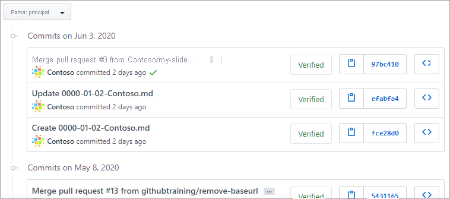
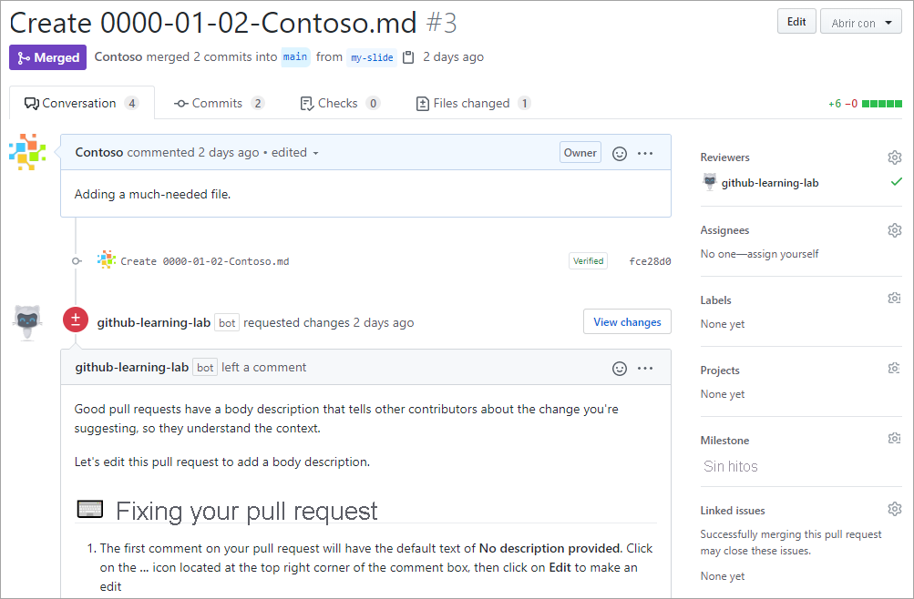
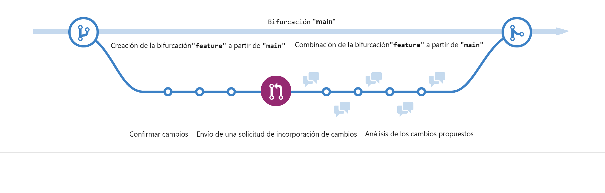

## Introducción a GitHub

___

## Introducción

GitHub proporciona una plataforma para desarrolladores con tecnología de inteligencia artificial para compilar, escalar y entregar software seguro. Tanto si planea nuevas características, corregir errores o colaborar en los cambios, GitHub es donde más de 100 millones de desarrolladores de todo el mundo se unen para crear cosas y mejorarlas aún más.

En este módulo, aprenderá los conceptos básicos de GitHub y comprenderá mejor sus características fundamentales con un ejercicio práctico en un repositorio de GitHub.

#### Objetivos de aprendizaje
En este módulo, aprenderá a hacer lo siguiente:

- Identificar las características fundamentales de GitHub
- Obtener más información sobre la administración de repositorios
- Obtener información sobre el flujo de GitHub, incluidas las ramas, las confirmaciones y las solicitudes de cambios
- Explorar las características colaborativas de GitHub mediante la revisión de problemas y discusiones
- Reconocer cómo administrar las notificaciones y suscripciones de GitHub

#### Requisitos previos
- Una cuenta de GitHub
___

## ¿Qué es GitHub?

En esta unidad, vamos a revisar los siguientes objetivos de aprendizaje:

- Información general breve de la plataforma GitHub Enterprise
- Creación de un repositorio
- Adición de archivos a un repositorio
- Búsqueda de repositorios
- Introducción a gists y wikis

#### GitHub


GitHub es una plataforma basada en la nube que usa Git, un sistema de control de versiones distribuido, en su núcleo. La plataforma GitHub simplifica el proceso de colaborar en proyectos y proporciona un sitio web, herramientas de línea de comandos y un flujo global que permite a los desarrolladores y usuarios trabajar juntos.

Como hemos aprendido anteriormente, GitHub proporciona una plataforma para desarrolladores con tecnología de inteligencia para crear, escalar y ofrecer software seguro. Vamos a desglosar cada uno de los pilares básicos de la plataforma GitHub Enterprise, inteligencia artificial, colaboración, productividad, seguridad y escala.

#### INTELIGENCIA ARTIFICIAL
La inteligencia artificial generativa está transformando drásticamente el desarrollo de software a medida que hablamos.

La plataforma GitHub Enterprise mejora la colaboración a través de solicitudes de incorporación de cambios y problemas con tecnología de inteligencia artificial, la productividad a través de Copiloto y la seguridad mediante la automatización de las comprobaciones de seguridad más rápido.

#### Colaboración
En esencia, colaboración de todo lo que hace GitHub. Sabemos que la colaboración ineficaz da como resultado tiempo y dinero desperdiciados. Lo contrarrestamos con un conjunto de herramientas sin fisuras que permiten colaborar sin esfuerzo.

Los repositorios, las incidencias, las solicitudes de incorporación de cambios y otras herramientas ayudan a los desarrolladores, administradores de proyectos, líderes de operaciones y otros usuarios de la misma empresa a trabajar más rápido, reducir los tiempos de aprobación y enviar más rápidamente.

#### Productividad
La productividad se acelera con la automatización que proporciona la plataforma GitHub Enterprise. Con las herramientas de CI/CD integradas directamente en el flujo de trabajo, la plataforma ofrece a los usuarios la capacidad de establecer tareas y olvidarlas, cuidar de la administración rutinaria y acelerar el trabajo diario. Esto proporciona a los desarrolladores más tiempo para centrarse en lo que más importa: crear soluciones innovadoras.

#### Seguridad
GitHub se centra en integrar la seguridad directamente en el proceso de desarrollo desde el principio. La plataforma GitHub Enterprise incluye características de seguridad nativas y de primera entidad que minimizan el riesgo de seguridad con una solución de seguridad integrada. Además, el código permanece privado dentro de su organización y, al mismo tiempo, puede aprovechar las ventajas de la información general de seguridad y Dependabot.

GitHub ha seguido realizando inversiones para asegurarse de que nuestras características estén listas para la empresa. Estamos respaldados por Microsoft, que confía en sectores altamente regulados y cumplen los requisitos de cumplimiento globalmente.

#### Escala
GitHub es la comunidad de desarrolladores más grande de su tipo. Con datos en tiempo real en más de 100 000 desarrolladores, más de 330 000 repositorios e innumerables implementaciones, hemos podido comprender las necesidades cambiantes de los desarrolladores y realizar cambios en nuestro producto para adaptarnos a ellas.

Esto se ha traducido en una escala increíble que no tiene parangón ni comparación con ninguna otra empresa del planeta. Cada día obtenemos más información de esta impresionante comunidad y hacemos evolucionar la plataforma para satisfacer sus necesidades.

En esencia, la plataforma GitHub Enterprise se centra en la experiencia del desarrollador: tiene la escala necesaria para ofrecer perspectivas que cambian el sector, capacidades de colaboración para una eficiencia transformadora, las herramientas para aumentar la productividad, seguridad en cada paso y la inteligencia artificial para impulsarlo todo a nuevas cotas en una única plataforma integrada.

Ahora vamos a entrar en la columna vertebral de GitHub, los repositorios.

#### Introducción a los repositorios
Repasemos primero:

- ¿Qué es un repositorio?
- Creación de un repositorio
- Adición de archivos a un repositorio
- Búsqueda de repositorios
- Introducción a gists, wikis y páginas de GitHub

#### ¿Qué es un repositorio?
Un repositorio contiene todos los archivos de tu proyecto y el historial de revisiones de cada uno de ellos. Es una de las partes esenciales que le ayuda a colaborar con personas. Puede utilizar repositorios para administrar el trabajo, realizar un seguimiento de los cambios, almacenar el historial de revisiones y trabajar con otras personas. Antes de profundizar demasiado, empecemos por cómo crear un repositorio.

#### Creación de un repositorio
Puedes crear un repositorio nuevo en tu cuenta personal o la cuenta de cualquier organización en la que tengas los permisos suficientes.

Vamos a abordar la creación de un repositorio desde github.com.

1. En la esquina superior derecha de cualquier página, utilice el menú desplegable y seleccione Nuevo repositorio.


2. Usa el menú desplegable Propietario para seleccionar la cuenta que quieres que sea propietaria del repositorio.


3. Teclea el nombre de tu repositorio, y una descripción opcional.


4. Elige la visibilidad del repositorio.
- Los repositorios públicos son accesibles para todo el mundo en Internet.
- A los repositorios privados solo pueden acceder usted, las personas con las que comparta explícitamente el acceso y, en el caso de los repositorios de organizaciones, determinados miembros de la organización.

5. Haga clic en Crear repositorio y ¡enhorabuena! Acaba de crear un repositorio.

A continuación, vamos a repasar cómo agregar archivos al repositorio.

#### Adición de un archivo al repositorio
Los archivos en GitHub pueden hacer algunas cosas, pero su propósito principal es almacenar datos e información sobre su proyecto.

Vamos a repasar cómo agregar un archivo al repositorio.

Pero antes de empezar, conviene saber que para agregar un archivo a un repositorio primero debe tener un acceso mínimo de escritura dentro del repositorio al que desea añadir un archivo.

1. En GitHub.com, vaya a la página principal del repositorio.

2. En tu repositorio, dirígete a la carpeta en la que deseas crear un archivo.

3. Sobre la lista de archivos, seleccione el menú desplegable Agregar archivo ᐁ y, a continuación, haga clic en ᐩ Crear nuevo archivo. Como alternativa, puede hacer clic en el signo más (ᐩ) en la vista de árbol de archivos de la izquierda.


4. En el campo de nombre, teclea el nombre y la extensión del archivo. Para crear subdirectorios, escriba el separador de directorios /.

5. En el cuadro de texto de contenido del archivo, escribe el contenido del archivo.

6. Para revisar el nuevo contenido, encima del contenido del archivo, haz clic en Vista previa.


7. Haga clic en Confirmar cambios.

8. En el campo de "Mensaje de confirmación", escriba un mensaje de confirmación corto y significativo que describa la modificación que hizo en el archivo. Puedes atribuir el cambio a mas de un autor en el mensaje del mismo.

9. Si tiene más de una dirección de correo electrónico asociada a su cuenta en GitHub.com, haga clic en el menú desplegable de direcciones de correo electrónico y seleccione la dirección de correo electrónico que desea utilizar como dirección de autor Git. Únicamente las direcciones de correo electrónico verificadas aparecen en el menú desplegable. Si ha habilitado la privacidad de la dirección de correo electrónico, entonces [nombreDeUsuario]@usuarios.noreply.github.com es la dirección de correo electrónico predeterminada del autor de la confirmación.


10. Debajo de los campos para el mensaje de confirmación, decide si deseas agregar tu confirmación a la rama actual o a una rama nueva. Debajo de los campos del mensaje de confirmación, decide si deseas agregar tu confirmación a la rama actual o a una nueva rama. Si tu rama actual es la rama predeterminada, debes elegir crear una nueva rama para tu confirmación y después crear una solicitud de extracción.


11. Haz clic en Confirmar cambios o Proponer cambios.

Enhorabuena, acaba de crear un nuevo archivo en el repositorio. También ha creado una nueva rama y ha realizado un commit.

Pero antes de revisar las ramas y los commits en la siguiente unidad, revisemos rápidamente las gists, wikis y páginas de GitHub porque son similares a los repositorios.

#### ¿Qué son los gists?
Ahora que conocemos bien los repositorios, podemos revisar los gists. Al igual que los repositorios, las gists son una forma simplificada de compartir fragmentos de código con otras personas.

Cada gist es un repositorio Git, que puede bifurcar y clonar y que puede ser público o secreto.

Los gists públicos se muestran públicamente, donde se pueden consultar los nuevos a medida que se crean. También se pueden buscar gists públicos.

Por el contrario, los gists secretos no se pueden buscar, pero no son completamente privados. Si envía la dirección URL de un gist secreto a un amigo, podrá verlo.

Para obtener más información sobre gists, consulte el artículo vinculado de nuestra sección Recursos, al final de este módulo, titulado Creación de gists.

#### ¿Qué son las wikis?
Cada repositorio de GitHub.com incluye una sección para hospedar documentación, denominada wiki.

Puedes usar la wiki de tu repositorio para compartir contenido en forma completa acerca de tu proyecto, como por ejemplo cómo usarlo, cómo lo diseñaste o sus principios básicos.

Aunque un archivo LÉAME indica rápidamente lo que puede hacer el proyecto, puede usar una wiki para proporcionar documentación adicional.

Vale la pena recordar que si su repositorio es privado solo los usuarios que tengan al menos acceso de lectura a su repositorio tendrán acceso a la wiki.

___

## Componentes del flujo de GitHub
En esta unidad, se revisarán los siguientes componentes del flujo de GitHub:

- Ramas
- Confirmaciones
- Solicitudes de incorporación de cambios
- El flujo de GitHub

#### Qué son las ramas
En la última sección, hemos creado un nuevo archivo mientras usted también creaba una nueva rama en sus repositorios.

Las ramas son una parte esencial de la experiencia de GitHub porque en ellas es donde podemos realizar cambios sin que afecten a todo el proyecto en el que estamos trabajando.

La rama es un lugar seguro para experimentar con nuevas características o correcciones. Si comete un error, puede revertir sus cambios o insertar más cambios para subsanarlo. Los cambios no se actualizarán en la rama predeterminada hasta que combine la rama.

     Nota:
     Como alternativa, puede crear una nueva rama y extraerla del repositorio simplemente usando Git en un terminal; el comando sería git checkout -b newBranchName.

#### ¿Qué son las confirmaciones?
Como puede que haya observado en la unidad anterior, al agregar un nuevo archivo al repositorio, es necesario insertar una confirmación.

Revisemos brevemente qué son las confirmaciones.

Una confirmación es un cambio en uno o varios archivos de una rama. Cada vez que se crea una confirmación, se le asigna un identificador único y se realiza un seguimiento de ella, junto con la hora y el colaborador. Las confirmaciones proporcionan un registro de auditoría claro para todas las personas que revisen el historial de un archivo o un elemento vinculado, como una incidencia o una solicitud de incorporación de cambios.


Dentro de un repositorio de Git, un archivo puede existir en varios estados válidos durante su paso por el proceso de control de versiones:

Los estados principales de un archivo en un repositorio Git son:

Sin seguimiento: estado inicial de un archivo cuando aún no forma parte del repositorio de Git. Git desconoce su existencia.

Con seguimiento: un archivo con seguimiento es aquel que Git supervisa activamente. Puede estar en uno de los siguientes subestados:

- Sin modificar: se realiza un seguimiento del archivo, pero no se ha modificado desde la última confirmación.
- Modificado: el archivo se ha cambiado desde la última confirmación, pero estos cambios aún no están almacenados provisionalmente para la siguiente confirmación.
- Almacenado provisionalmente: el archivo se ha modificado y los cambios se han agregado al área de almacenamiento provisional (también conocida como índice). Estos cambios están listos para confirmarse.
- Confirmado: el archivo se encuentra en la base de datos del repositorio. Representa la versión confirmada más reciente del archivo.

Estos estados y subestados son importantes para colaborar con el equipo y saber dónde se encuentra cada confirmación en el proceso del proyecto.

Ahora vamos a pasar a las solicitudes de incorporación de cambios.

#### ¿Qué son las solicitudes de incorporación de cambios?
Ahora que sabemos qué es una confirmación, revisemos las solicitudes de incorporación de cambios.

Una solicitud de incorporación de cambios es un mecanismo que sirve para indicar que las confirmaciones de una rama están listas para combinarse en otra.

El miembro del equipo que envía la solicitud de incorporación de cambios normalmente solicita a uno o varios revisores que comprueben el código y aprueben la combinación. Estos revisores podrán comentar los cambios, agregar otros o usar la solicitud de incorporación de cambios para realizar un análisis más exhaustivo.

Una vez que los cambios se han aprobado (si es que necesitan aprobación), la rama de origen de la solicitud de incorporación de cambios (la rama de comparación) se combina con la rama base.


Ahora que conocemos todos los ingredientes, revisemos el flujo de GitHub.

#### El flujo de GitHub


El flujo de GitHub se puede definir como un flujo de trabajo ligero que permite experimentar de forma segura. Puede probar nuevas ideas y colaboraciones con su equipo mediante ramas, solicitudes de incorporación de cambios y combinaciones.


Ahora que conocemos los conceptos básicos de GitHub, podemos recorrer el flujo de GitHub y sus componentes.

- El primer paso del flujo de GitHub consiste en crear una rama para que los cambios, características y correcciones que cree no afecten a la rama principal.
- El segundo paso es realizar los cambios. Se recomienda implementar cambios en la rama de características antes de combinarlos en la rama principal. De esta forma, se tiene la seguridad de que los cambios son válidos en un entorno de producción.
- El tercer paso consiste en crear una solicitud de incorporación de cambios para pedir comentarios a los colaboradores. La revisión de solicitude sde cambios es tan valiosa que algunos repositorios requieren una revisión aprobatoria antes de que estas se puedan fusionar.
- A continuación, el cuarto paso consiste en revisar e implementar los comentarios de los colaboradores.
- Una vez que se sienta a gusto con los cambios, el quinto paso es aprobar la solicitud de incorporación de cambios y combinarla en la rama principal.
- El sexto y último paso es eliminar la rama. Al eliminar la rama se indica que el trabajo en la rama se ha completado y se evita que usted u otros usuarios empleen accidentalmente ramas antiguas.

Y eso es todo, acaba de recorrer el ciclo de un flujo de GitHub.

Vamos a pasar a la siguiente sección donde trataremos las diferencias entre incidencias y discusiones.

___

## GitHub es una plataforma colaborativa
Como hemos mencionado anteriormente, la colaboración es el núcleo de todo lo que hace GitHub.

Hemos repasado los repositorios en la primera unidad del módulo y hemos aprendido que los repositorios le ayudan a organizar el proyecto y sus archivos.

En la anterior unidad, aprendimos sobre las solicitudes de incorporación de cambios, una manera de realizar un seguimiento de los cambios realizados en el proyecto.

En esta unidad, aprenderemos sobre las incidencias y los debates, otras dos partes que contribuyen a la naturaleza colaborativa de la plataforma de GitHub Enterprise.

#### Incidencias
Las Incidencias de GitHub se crearon para realizar un seguimiento de ideas, comentarios, tareas o errores para trabajar en GitHub.

Las incidencias se pueden crear de varias maneras, por lo que puede elegir el método más conveniente para su flujo de trabajo.

En el tutorial de la siguiente parte, veremos cómo crear una incidencia a partir de un repositorio, pero debe saber que hay un sinfín de formas. Esta es una lista de todas las formas en que puede crear incidencias.

Las distintas formas de crear una incidencia a partir de:
- un repositorio
- un elemento de una lista de tareas
- una nota en un proyecto
- un comentario en una incidencia o una solicitud de incorporación de cambios
- una línea de código específica
- o una consulta de dirección URL

#### Crear una propuesta desde un repositorio

1. En GitHub.com, vaya a la página principal del repositorio.

2. En el nombre del repositorio, haga clic en (insertar icono de incidencias) Incidencias.


3. Haz clic en Nueva propuesta.

4. Si en el repositorio se usan plantillas de incidencia, haga clic en Comenzar junto al tipo de incidencia que quiera abrir.
Si el tipo de problema que desea abrir no se incluye en las opciones disponibles, haga clic en Abrir una incidencia en blanco.


5. En el campo "Título", escriba un título para la incidencia.

6. En el campo cuerpo del comentario, escriba una descripción de la incidencia.

7. Si es un mantenedor de proyectos, puede asignar la incidencia a alguien, agregarla a un panel de proyecto, asociarla a un hito o aplicar una etiqueta.

8. Cuando haya terminado, haga clic en Enviar nueva incidencia.

Algunas conversaciones son más adecuadas para los Debates de GitHub.

Puede usar Debates de GitHub para formular y responder preguntas, compartir información, realizar anuncios y realizar o participar en conversaciones sobre un proyecto.

En la siguiente sección, revisaremos Debates y veremos cómo usar mejor la característica.

#### Debates
Los debates son para conversaciones que deben ser accesibles para todos los usuarios y que no están relacionadas con el código. Los debates habilitan las conversaciones abiertas y fluídas en un foro público.

En esta sección vamos a tratar:
- Habilitación de un debate en el repositorio
- Creación de un nuevo debate y varias categorías de debate

Vamos a profundizar en la habilitación de un debate en el repositorio.

#### Habilitación de un debate en el repositorio
Los propietarios de repositorios y los usuarios con acceso de escritura pueden habilitar los Debates de GitHub para una comunidad en sus repositorios públicos y privados. La visibilidad de un debate se hereda del repositorio en el que se crea el debate.

Cuando habilite por primera vez los GitHub, se le invitará a configurar una publicación de bienvenida.

1. En GitHub.com, vaya a la página principal del repositorio.

2. En el nombre del repositorio, haga clic en (icono de engranaje) Configuración.


3. Desplácese hacia abajo hasta la sección "Características" y haga clic en Configurar debates.


4. Debajo de "Iniciar un debate nuevo" edita la plantilla para que se apegue con los recursos y el tono que quieras configurar para tu comunidad.

5. Haga clic en Start discussion (Iniciar debate).

Ya está listo para crear un nuevo debate.

#### Creación de un nuevo debate
Cualquier usuario autenticado que pueda ver un repositorio puede crear un debate en dicho repositorio.

Del mismo modo, dado que los debates de una organización se basan en un repositorio de origen, cualquier usuario autenticado que pueda ver el repositorio de origen puede crear un debate en esa organización.

1. En GitHub.com, vaya a la página principal del repositorio o la organización donde desea iniciar un debate.

2. En el nombre del repositorio o la organización, haga clic en Debates.


3. En el lado derecho de la página, haz clic en Nueva discusión.

4. Selecciona una categoría de discusión haciendo clic en Comenzar. Todos los debates deben crearse en una categoría. En el caso de los debates del repositorio, las personas con permisos de mantenedor o administrador en el repositorio definen las categorías de los debates de dicho repositorio.


Cada categoría debe tener un nombre único y un emparejamiento de emoticonos e ir acompañado de una descripción detallada que indique su propósito. Las categorías ayudan a los encargados a organizar cómo se archivan las conversaciones y son personalizables para ayudar a distinguir las categorías que son Q&A o conversaciones más abiertas. En la tabla siguiente se muestran las categorías predeterminadas para debates y sus propósitos.

| Categoría | Propósito | Formato |
|:------------:|:------------:|:------------:|
| 📣 Anuncios    | Actualizaciones y noticias de los mantenedores de proyecto    | Anuncio    |
| #️⃣ General    | Cualquier cosa que sea relevante para el proyecto    | Debates abiertos    |
| 💡 Ideas    | Ideas para cambiar o mejorar el proyecto    | Debates abiertos    |
| 🗳️ Sondeos | Sondeos con varias opciones para que la comunidad vote y debata | Sondeos |
|🙏 Q&A | Preguntas para que responda la comunidad, con un formato de pregunta/respuesta | Preguntas y respuestas |
| 🙌 Mostrar y contar |	Creaciones, experimentos, o pruebas relevantes para el proyecto |	Debates abiertos

5. En "Título del debate", escriba un título para su debate y, en "Escribir", escriba el cuerpo del debate.


6. Haga clic en Start discussion (Iniciar debate).

Esto ilustra un poco cómo GitHub inspira la colaboración. Ahora vamos a pasar a cómo administrar notificaciones, suscribirse a subprocesos y empezar a trabajar con las páginas de GitHub.

___ 

## Administración de la plataforma de GitHub
Ahora que conoce los conceptos básicos de la plataforma de GitHub, veamos algunos aspectos de la administración de la plataforma.

En esta unidad, trataremos:
- Administración de las notificaciones y suscripciones
- Suscripción a conversaciones y búsqueda de conversaciones en las que se menciona al usuario
- Promoción de una persona o de su organización en las páginas de GitHub

#### Administración de las notificaciones y suscripciones
Puede optar por recibir actualizaciones continuas sobre actividades específicas en GitHub.com a través de una suscripción. Las notificaciones son las actualizaciones que se reciben sobre la actividad específica a la que el usuario se ha suscrito.

#### Opciones de suscripción
Puedes elegir suscribirte a notificaciones para:

- Una conversación sobre un informe de problemas, solicitud de extracción o gist específico.
- Toda la actividad de un repositorio.
- Actividades de CI, tales como el estado de los flujos de trabajo en los repositorios configurados con Acciones de GitHub.
- Problemas del repositorio, solicitudes de incorporación de cambios, versiones, alertas de seguridad o discusiones (si están habilitados).

En algunos casos, y en determinados escenarios, se suscribe al usuario automáticamente a las conversaciones en GitHub. Por ejemplo, al abrir una solicitud de cambios o una incidencia, al comentar en una conversación, o cuando se asigna al usuario una incidencia o una solicitud de cambios.

Si ya no te interesa alguna conversación, te puedes dar de baja, dejar de seguir o personalizar los tipos de notificaciones que recibirás en el futuro.

Si en algún momento tiene interés por las incidencias en las que se menciona a un determinado usuario, puede usar "menciones:" como calificador para buscar esas incidencias concretas.

#### Qué son las páginas de GitHub

Para finalizar nuestro recorrido por GitHub, analicemos las páginas de GitHub.

Puede usar páginas de GitHub para publicitar y hospedar un sitio web sobre usted, su organización o su proyecto directamente desde un repositorio de GitHub.com.

GitHub Pages es un servicio de hospedaje de sitios estáticos que toma archivos HTML, CSS y JavaScript directamente desde un repositorio de GitHub. Opcionalmente, puede ejecutar los archivos a través de un proceso de compilación y publicar un sitio web.

Simplemente edite e introduzca los cambios y ya está, su proyecto estará disponible para el público de una manera visualmente organizada.

A continuación, le guiaremos por un ejercicio para empezar a trabajar con GitHub.

Podrá:
- Creación de un nuevo repositorio
- Creación de una rama
- Confirmar un archivo
- Apertura de una solicitud de incorporación de cambios
- Y combinar una solicitud de cambios

___

## Ejercicio: Paseo guiado por GitHub
En este ejercicio se comprueban sus conocimientos sobre las características clave de GitHub, incluida la confirmación de una rama, la confirmación de un archivo, la apertura de una solicitud de incorporación de cambios y la combinación de una solicitud de incorporación de cambios.

Al seleccionar el botón Iniciar el ejercicio en GitHub siguiente, se le redireccionará a un repositorio de plantillas de GitHub público que le pedirá que complete una serie de pequeños desafíos. Antes de comenzar el ejercicio, realice las siguientes tareas:

- Seleccione el botón Iniciar curso o la característica Usar esta plantilla en el repositorio de plantillas. Al hacerlo, se le pedirá que cree un repositorio nuevo. Se recomienda crear un repositorio público, ya que los repositorios privados usarán minutos de Acciones.

Después de crear su propio repositorio a partir de la plantilla, espere unos 20 segundos y actualice.

- Siga las instrucciones del archivo Léame del repositorio para comprender cómo funciona el ejercicio, los objetivos de aprendizaje y cómo completar correctamente el ejercicio
___

<header>

<!--
  <<< Author notes: Course header >>>
  Include a 1280×640 image, course title in sentence case, and a concise description in emphasis.
  In your repository settings: enable template repository, add your 1280×640 social image, auto delete head branches.
  Add your open source license, GitHub uses MIT license.
-->

# Introduction to GitHub

_Get started using GitHub in less than an hour._

</header>

<!--
  <<< Author notes: Step 2 >>>
  Start this step by acknowledging the previous step.
  Define terms and link to docs.github.com.
-->

## Step 2: Commit a file

_You created a branch! :tada:_

Creating a branch allows you to edit your project without changing the `main` branch. Now that you have a branch, it’s time to create a file and make your first commit!

**What is a commit?**: A _[commit](https://docs.github.com/pull-requests/committing-changes-to-your-project/creating-and-editing-commits/about-commits)_ is a set of changes to the files and folders in your project. A commit exists in a branch. For more information, see "[About commits](https://docs.github.com/en/pull-requests/committing-changes-to-your-project/creating-and-editing-commits/about-commits)".

### :keyboard: Activity: Your first commit

The following steps will guide you through the process of committing a change on GitHub. A commit records changes in renaming, changing content within, creating a new file, and any other changes made to your project. For this exercise, committing a change requires first adding a new file to your new branch.

1. On the **< > Code** tab in the header menu of your repository, make sure you're on your new branch `my-first-branch`.

2. Select the **Add file** drop-down and click **Create new file**.

   

3. In the **Name your file...** field, enter `PROFILE.md`.

   **Note:** `.md` is a file extension that creates a Markdown file. You can learn more about Markdown by visiting "[Basic writing and formatting syntax](https://docs.github.com/en/get-started/writing-on-github/getting-started-with-writing-and-formatting-on-github/basic-writing-and-formatting-syntax)" in our docs or by taking the "[Communicating using Markdown](https://github.com/skills/communicate-using-markdown)" Skills course.

4. In the **Enter file contents here** area, copy the following content to your file:

   ```
   Welcome to my GitHub profile!
   ```

   

5. Click **Commit changes...** in the upper right corner above the contents box. For commits, you can enter a short commit message that describes what changes you made. This message helps others know what's included in your commit. GitHub offers a simple default message, but let's change it slightly for practice. First, enter `Add PROFILE.md` in the first text-entry field titled "Commit message".

   

6. In this lesson, we'll ignore the other fields and click **Commit changes**.
7. Wait about 20 seconds then refresh this page (the one you're following instructions from). [GitHub Actions](https://docs.github.com/en/actions) will automatically update to the next step.

<footer>

<!--
  <<< Author notes: Footer >>>
  Add a link to get support, GitHub status page, code of conduct, license link.
-->

---

Get help: [Post in our discussion board](https://github.com/orgs/skills/discussions/categories/introduction-to-github) &bull; [Review the GitHub status page](https://www.githubstatus.com/)

&copy; 2023 GitHub &bull; [Code of Conduct](https://www.contributor-covenant.org/version/2/1/code_of_conduct/code_of_conduct.md) &bull; [MIT License](https://gh.io/mit)

</footer>

___

___ 
## Prueba de conocimientos
Elija la mejor respuesta para cada pregunta y, después, seleccione Comprobar las respuestas.

Comprobación de conocimientos

1. ¿Cuál es la mejor manera de notificar un error en un proyecto de GitHub? 
 - [ ] Enviar un correo electrónico a un propietario del proyecto.
 - [ ] No me tomo la molestia de notificar los errores de software porque no hay transparencia y, de todos modos, nunca se corrigen.
 - [ ] Buscar el error en las incidencias existentes del proyecto y crear uno nuevo si aún no se ha notificado.
<!-- Las incidencias de un proyecto son visibles para todas las personas que tengan acceso al proyecto, por lo que puede descubrir si ya hay una solución planificada o disponible. En caso de que no la haya, puede crear la incidencia y realizar un seguimiento. -->


2. Supongamos que ha creado una corrección de errores en una nueva rama y que quiere que forme parte de la siguiente compilación de producción generada a partir de la rama main. ¿Qué debe hacer a continuación? 
 - [ ] Copiar los cambios de la rama y confirmarlos directamente en la rama main.
 - [ ] Crear una solicitud de incorporación de cambios para combinar la nueva rama con la rama main.
 - [ ] Pensándolo bien, no voy a compartir esta corrección, sino que la incluiré en mi versión privada del código fuente.
<!-- Las solicitudes de incorporación de cambios son la manera correcta de comunicar que las confirmaciones están listas para su revisión y para la inclusión final en la rama main. -->


3. Supongamos que quiere trabajar con un proyecto en GitHub, pero no tiene acceso de escritura al proyecto. ¿Qué puede hacer para colaborar? 
 - [ ] Bifurcar el repositorio del proyecto en su cuenta de GitHub, clonar el repositorio bifurcado en el equipo local, insertar los cambios en el repositorio y enviar una solicitud de incorporación de cambios al repositorio de destino (ascendente).
 - [ ] Clonar el proyecto en el equipo local e insertar las actualizaciones directamente en el repositorio del proyecto.
 - [ ] Usar comandos de Git para hacer una copia del proyecto de modo que se pueda trabajar de forma local. Envíe una incidencia para insertar los cambios en el repositorio de destino.
<!-- GitHub proporciona una funcionalidad de bifurcación diseñada para que pueda trabajar con proyectos en los que no sea propietario o no tenga acceso de escritura. La bifurcación realiza una copia remota del proyecto en el repositorio que se puede clonar localmente. Para enviar actualizaciones al repositorio de destino (el repositorio ascendente), puede enviar una solicitud de incorporación de cambios. -->
___

## Resumen
En este módulo:

- Identificar las características fundamentales de GitHub
- Obtener más información sobre la administración de repositorios
- Obtener información sobre el flujo de GitHub, incluidas las ramas, las confirmaciones y las solicitudes de incorporación de cambios
- Explorar las características colaborativas de GitHub mediante la revisión de problemas y discusiones
- Reconocer cómo administrar las notificaciones y suscripciones de GitHub

Ahora que está familiarizado con los conceptos básicos de GitHub, aprenda a *[cargar el proyecto mediante procedimientos recomendados de GitHub][50]*.

#### Más información
Aquí se proporcionan algunos vínculos para obtener más información sobre los temas tratados en este módulo.

*[Configurar Git][51]*
*[Documentación de repositorios][52]*
*[Creación de gist][53]*
*[Acerca de las wikis][54]*
*[Acerca de las ramas][55]*
*[Acerca de las confirmaciones][56]*
*[Acerca de las solicitudes de incorporación de cambios][57]*
*[Acerca de los problemas][58]*
*[Inicio rápido para Debates de GitHub][59]*
*[Configuración de notificaciones][60]*
*[Trabajo con GitHub Pages][61]*


[50]: https://learn.microsoft.com/es-es/training/modules/upload-project-github/ 

[51]: https://docs.github.com/en/get-started/quickstart/set-up-git
[52]: https://docs.github.com/en/repositories
[53]: https://docs.github.com/en/get-started/writing-on-github/editing-and-sharing-content-with-gists/creating-gists
[54]: https://docs.github.com/en/communities/documenting-your-project-with-wikis/about-wikis
[55]: https://docs.github.com/en/pull-requests/collaborating-with-pull-requests/proposing-changes-to-your-work-with-pull-requests/about-branches
[56]: https://docs.github.com/en/pull-requests/committing-changes-to-your-project/creating-and-editing-commits/about-commits
[57]: https://docs.github.com/en/pull-requests/collaborating-with-pull-requests/proposing-changes-to-your-work-with-pull-requests/about-pull-requests
[58]: https://docs.github.com/en/issues/tracking-your-work-with-issues/about-issues
[59]: https://docs.github.com/en/discussions/quickstart
[60]: https://docs.github.com/en/account-and-profile/managing-subscriptions-and-notifications-on-github/setting-up-notifications/configuring-notifications
[61]: https://help.github.com/en/github/working-with-github-pages

___