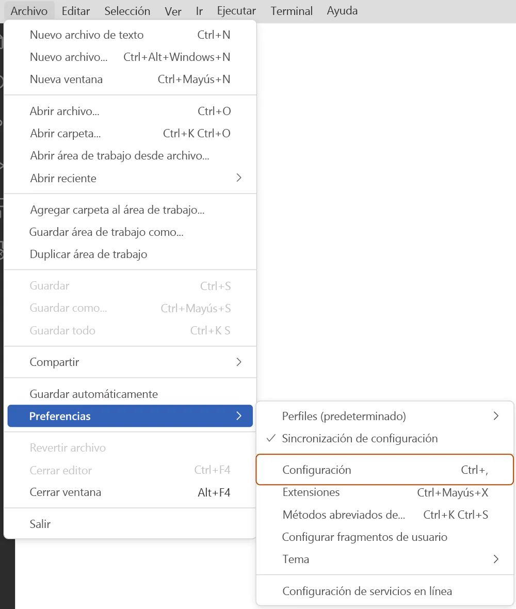

## Introducción a GitHub Copilot

GitHub Copilot usa OpenAI Codex para sugerir código y funciones completas en tiempo real, directamente desde el editor.

___ 

## Introducción

GitHub Copilot es la primera herramienta para desarrolladores de inteligencia artificial a escala del mundo que puede ayudarle a escribir código más rápidamente y con menos trabajo. GitHub Copilot extrae el contexto de los comentarios y el código para sugerir líneas individuales y funciones completas al instante.

La investigación ha permitido saber que GitHub Copilot ayuda a los desarrolladores a codificar con mayor rapidez, a centrarse en resolver problemas mayores, a mantenerse informados durante más tiempo y a sentirse más gratificado con su trabajo.

El modelo de lenguaje preentrenado generativo de GitHub Copilot usa la tecnología de OpenAI Codex y lo crea OpenAI. Hay una extensión disponible para Visual Studio Code, Visual Studio, Neovim y el conjunto JetBrains de entornos de desarrollo integrados (IDE).

#### Objetivos de aprendizaje

Al término de este módulo, podrá hacer lo siguiente:
- Explicar qué es GitHub Copilot y las ventajas que proporciona.
- Comprender la disponibilidad de GitHub Copilot para individuos y empresas.
- Analizar el futuro de GitHub Copilot con Copilot X.
- Aprender a usar GitHub Copilot y algunas configuraciones comunes.
- Desarrollar con GitHub Copilot con Visual Studio Code mediante ejercicios prácticos.

#### Requisitos previos
- Una cuenta de GitHub
- Conocimientos sobre los aspectos básicos de GitHub

___ 

## GitHub Copilot, el programador de pares de IA


No es un secreto que la inteligencia artificial está alterando el panorama tecnológico. La inteligencia artificial está cambiando profundamente la forma en que funciona el mundo y cómo opera cada organización y equipo. Estos avances en la inteligencia artificial sirven como catalizador y mejoran drásticamente la productividad de los desarrolladores de todo el mundo a medida que los usan y aplican de manera correcta.

En lo que respecta a los desarrolladores, agregar características de inteligencia artificial a las herramientas de desarrollo que usa y que admira le ayuda a colaborar, desarrollar, probar y enviar los productos de forma más rápida y eficaz que nunca.

GitHub Copilot es un servicio que le proporciona un programador de pares de IA que funciona con todos los lenguajes de programación conocidos y acelera considerablemente la productividad general de los desarrolladores. En investigaciones recientes, GitHub y Microsoft han encontrado que los desarrolladores experimentan un aumento significativo de la productividad al trabajar en proyectos y tareas reales al usar GitHub Copilot. De hecho, en menos de dos años desde su lanzamiento, los desarrolladores han experimentado lo siguiente al usar GitHub Copilot:

- El 46 % del código nuevo ahora está escrito mediante inteligencia artificial
- La productividad general de los desarrolladores es un 55 % más rápida
- El 74 % de los desarrolladores se sienten más centrados en hacer el trabajo que les gusta

Desarrollado en colaboración con OpenAI, GitHub Copilot cuenta con la tecnología de OpenAI Codex, un sistema de inteligencia artificial creado por OpenAI. OpenAI Codex tiene un amplio conocimiento de cómo las personas usan código, y es más capaz que GPT-3 en la generación de código, en parte, porque se entrenó en un conjunto de datos que incluye una mayor concentración de código fuente público.

GitHub Copilot está disponible como una extensión para Visual Studio Code, Visual Studio, Neovim y el conjunto JetBrains de entornos de desarrollo integrados (IDE).

#### GitHub Copilot X

GitHub Copilot inició una nueva era de desarrollo de software como programador de pares de IA que permite que los desarrolladores no pierdan el ritmo de trabajo al autocompletar los comentarios y el código. Sin embargo, autocompletar con inteligencia artificial fue solo el punto de partida. GitHub Copilot X es la visión del futuro del desarrollo de software con tecnología de IA que adopta los modelos GPT-4 más recientes de OpenAI.

GitHub Copilot X se extiende más allá del editor y se convierte en un asistente de inteligencia artificial fácilmente accesible durante todo el ciclo de vida de desarrollo.

Estas son algunas características de GitHub Copilot X que estarán a punto próximamente.

#### Una experiencia similar a ChatGPT en el editor con GitHub Copilot Chat

Copilot X aporta una interfaz de chat al editor que se centra en escenarios de desarrollador y se integra de forma nativa con VS Code y Visual Studio. Reconoce qué código ha escrito un desarrollador, qué mensajes de error se muestran y está profundamente insertado en el IDE. Un desarrollador puede obtener análisis detallados y explicaciones de para qué están diseñados los bloques de código, generar pruebas unitarias e incluso obtener correcciones propuestas para errores.

#### Copilot para solicitudes de incorporación de cambios

Esta nueva funcionalidad se basa en el nuevo modelo GPT-4 de OpenAI y agrega compatibilidad con etiquetas con tecnología de IA en descripciones de solicitudes de incorporación de cambios a través de una aplicación de GitHub que los administradores de la organización y los propietarios de repositorios individuales pueden instalar. GitHub Copilot rellena automáticamente estas etiquetas en función del código cambiado. A continuación, los desarrolladores pueden revisar o modificar la descripción sugerida.

#### Respuestas generadas por IA sobre la documentación

GitHub lanza GitHub Copilot for Docs, una herramienta experimental que usa una interfaz de chat para proporcionar a los usuarios respuestas generadas por IA a preguntas sobre la documentación, incluidas las preguntas que los desarrolladores tienen sobre los lenguajes, marcos y tecnologías que usan.

#### Copilot para la interfaz de la línea de comandos (CLI)

Junto al editor y la solicitud de incorporación de cambios, el terminal es el lugar donde los desarrolladores pasan más tiempo. Sin embargo, incluso los desarrolladores más expertos deben desplazarse a lo largo de muchas páginas para recordar la sintaxis de muchos comandos. La CLI de Copilot de GitHub puede crear comandos y bucles, y generar marcas de búsqueda ocultas para satisfacer la consulta.

#### GitHub Copilot para empresas

GitHub Copilot está disponible a través de cuentas personales de GitHub con GitHub Copilot for Individuals o a través de cuentas empresariales o para organizaciones con GitHub Copilot for Business.

Con Copilot para empresas, puede administrar el acceso a GitHub Copilot para organizaciones dentro de su empresa. Una vez que concede acceso a GitHub Copilot a una organización, los administradores de dicha organización pueden conceder acceso a sus usuarios y equipos.

Con GitHub Copilot for Business, GitHub Copilot está abierto a todos los desarrolladores, equipos, organizaciones y empresas.

Centrado en hacer que las organizaciones sean más productivas, seguras y satisfactorias, GitHub Copilot for Business permite a los desarrolladores codificar más rápido y les permite centrarse en un trabajo que les guste más.

A continuación, se muestran algunas de las características que observará en Copilot para empresas:

- Un modelo de IA más eficaz: los nuevos algoritmos de modelado mejoran la calidad de las sugerencias de código.
- Filtrado de vulnerabilidades de seguridad basado en inteligencia artificial: GitHub Copilot bloquea automáticamente las sugerencias de código no seguras comunes al enfocarse en problemas como credenciales codificadas de forma rígida, inyecciones de SQL e inyecciones de ruta de acceso.
- Compatibilidad con proxy VPN: GitHub Copilot funciona con VPN, incluidos los certificados autofirmados, para que los desarrolladores puedan usarlo en cualquier entorno de trabajo.
- Registro sencillo: cualquier empresa puede comprar rápidamente licencias de Copilot para empresas en línea y asignar fácilmente puestos, incluso si no usan la plataforma de GitHub para su código fuente.

Para obtener más información sobre GitHub Copilot for Business, consulte los vínculos relacionados al final de este módulo.

En la unidad siguiente, veremos cómo empezar a trabajar con GitHub Copilot y algunas configuraciones habituales.

___ 

## Instalación, configuración y solución de problemas de GitHub Copilot

En esta unidad, se describe cómo registrarse en GitHub Copilot, cómo configurar GitHub Copilot mediante Visual Studio Code y algunos pasos para solucionar problemas de GitHub Copilot mediante Visual Studio Code.

#### Registro en GitHub Copilot
Para poder empezar a usar GitHub Copilot, es preciso configurar una evaluación gratuita o una suscripción para tu cuenta personal.

Para ello, seleccione su foto de perfil y, después, seleccione Configuración. Copilot está en el menú de la izquierda en Código, planeamiento y automatización.

Después de registrarse, deberá instalar una extensión para su entorno preferido. GitHub Copilot admite GitHub.com, Visual Studio Code, Visual Studio, los entornos de desarrollo integrado de JetBrains y Neovim como una extensión discreta.

Para este módulo concreto, solo se van a examinar las extensiones y las configuraciones de Visual Studio Code, ya que el ejercicio que completaremos en este módulo usa Visual Studio Code.

Si usa otro entorno, puede encontrar vínculos específicos para configurarlo en la sección Referencias del final de este módulo.

#### Configuración de GitHub Copilot en Visual Studio Code

#### *Incorporación de la extensión de Visual Studio Code*
Siga estos pasos para agregar la extensión de Visual Studio Code para GitHub Copilot.

1. En Visual Studio Code Marketplace, vaya a la *[página de la extensión de GitHub Copilot][5]* y seleccione Instalar.
2. Aparecerá un elemento emergente que le solicita abrir Visual Studio Code. Seleccione Open (Abrir).
3. En la pestaña Extensión: GitHub Copilot de Visual Studio Code, seleccione Instalar.
4. Si no ha autorizado previamente Visual Studio Code en su cuenta de GitHub, se le pedirá que inicie sesión en GitHub en Visual Studio Code. Seleccione Iniciar sesión en GitHub.

[5]: https://marketplace.visualstudio.com/items?itemName=GitHub.copilot

GitHub Copilot puede autocompletar el código a medida que lo escribe cuando usa Visual Studio Code. Después de la instalación, puede habilitar o deshabilitar GitHub Copilot, y puede configurar opciones avanzadas en Visual Studio Code.

#### Habilitación o deshabilitación de GitHub Copilot en Visual Studio Code

1. Para habilitar o deshabilitar GitHub Copilot, seleccione el icono de estado del panel inferior de la ventana de Visual Studio Code


2. Al deshabilitar GitHub Copilot, se le pregunta si desea deshabilitar las sugerencias globalmente, o bien para el idioma del archivo que está editando en ese momento.

- Para deshabilitar las sugerencias de GitHub Copilot globalmente, seleccione Deshabilitar globalmente.
- Para deshabilitar las sugerencias de GitHub Copilot para un idioma especificado, seleccione Deshabilitar para IDIOMA.

#### Habilitación o deshabilitación de sugerencias insertadas en Visual Studio Code

1. En el menú Archivo, vaya a Preferencias y seleccione Configuración.



2. En el panel izquierdo de la pestaña de configuración, seleccione Extensiones y, después, seleccione Copilot.

3. En Sugerencia insertada: habilitar, seleccione o anule la selección de la casilla para habilitar o deshabilitar las sugerencias insertadas

Además, puede optar por habilitar o deshabilitar las sugerencias insertadas y especificar los idiomas para los que desea habilitar o deshabilitar GitHub Copilot.

#### Solución de problemas de GitHub Copilot en Visual Studio Code
En Visual Studio Code, los archivos de registro son útiles para diagnosticar problemas de conexión. La extensión GitHub Copilot almacena los archivos de registro en la ubicación de registro estándar para las extensiones de Visual Studio Code. Puede encontrar los archivos de registro por medio de la opción de desarrollador y abrir la carpeta de registros de extensión dentro de Visual Studio Code.

En algunos casos, es posible que los errores no se registren en las ubicaciones normales. Si encuentra errores y no hay nada en los registros, puede intentar verlos en el proceso que ejecuta Visual Studio Code y la extensión. Este proceso le permite ver los registros de Electron. Puede encontrar estos registros en "Desarrollador" y en Ayuda>Activar herramientas de desarrollo en Visual Studio Code.

Al conectarse a GitHub Copilot, pueden producirse restricciones de red, firewalls o un proxy. Si esto ocurriera, siga estos pasos para abrir un nuevo editor con información pertinente que puede inspeccionar o compartir con el equipo de soporte técnico.

1. Abra la paleta de comandos Visual Studio Code:
- En Mac, use Mayús+Comando+P
- En Windows o Linux, use Ctrl+Mayús+P

2. Escriba Diagnósticos y, después, seleccione GitHub Copilot: Recopilar diagnósticos en la lista.

Para más información sobre cómo solucionar problemas en otros entornos, consulte la sección Referencias de la última unidad del módulo.

___

## Ejercicio: Desarrollo con sugerencias de código con tecnología de IA mediante GitHub Copilot y VS Code

Este ejercicio le guiará por los pasos siguientes:
- Instalación de GitHub Copilot mediante GitHub Codespaces
- Solicitar sugerencias de código de GitHub Copilot
- Aceptar sugerencias de código de GitHub Copilot

#### Introducción
Al seleccionar el botón Iniciar el ejercicio en GitHub, se le redireccionará a un repositorio de plantillas de GitHub público que le pedirá que complete una serie de pequeños desafíos. Antes de comenzar el ejercicio, realice las siguientes tareas:

Seleccione el botón Iniciar curso o la característica Usar esta plantilla en el repositorio de plantillas. Al hacerlo, se le pedirá que cree un repositorio nuevo. Se recomienda crear un repositorio público, ya que los repositorios privados usan minutos de Acciones. Después de crear su propio repositorio a partir de la plantilla, espere unos 20 segundos y actualice.

Siga las instrucciones del archivo Léame del repositorio para comprender cómo funciona el ejercicio, los objetivos de aprendizaje y cómo completar correctamente el ejercicio.

Cuando haya terminado el ejercicio en GitHub, vuelva a este módulo para hacer lo siguiente:
- Prueba de conocimientos breve
- Resumen de lo que ha aprendido
- Distintivo por completar este módulo.

        Nota:
        No es necesario modificar los archivos del flujo de trabajo para completar este ejercicio. La modificación del contenido de este flujo de trabajo puede interrumpir la capacidad del ejercicio para validar las acciones, proporcionar comentarios o calificar los resultados.

___

<header>

<!--
  <<< Author notes: Course header >>>
  Read <https://skills.github.com/quickstart> for more information about how to build courses using this template.
  Include a 1280×640 image, course name in sentence case, and a concise description in emphasis.
  In your repository settings: enable template repository, add your 1280×640 social image, auto delete head branches.
  Next to "About", add description & tags; disable releases, packages, & environments.
  Add your open source license, GitHub uses the MIT license.
-->

# Code with GitHub Copilot

_GitHub Copilot can help you code by offering autocomplete-style suggestions right in VS Code and Codespaces._

</header>

<!--
  <<< Author notes: Step 1 >>>
  Choose 3-5 steps for your course.
  The first step is always the hardest, so pick something easy!
  Link to docs.github.com for further explanations.
  Encourage users to open new tabs for steps!
-->

## Step 1: Leverage Codespaces with VS Code for Copilot

_Welcome to "Develop With AI Powered Code Suggestions Using GitHub Copilot and VS Code"! :wave:_

GitHub Copilot is an AI pair programmer that helps you write code faster and with less work. It draws context from comments and code to suggest individual lines and whole functions instantly. GitHub Copilot is powered by OpenAI Codex, a generative pretrained language model created by OpenAI.

**Copilot works with many code editors including VS Code, Visual Studio, JetBrains IDE, and Neovim.**

Additionally, GitHub Copilot is trained on all languages that appear in public repositories. For each language, the quality of suggestions you receive may depend on the volume and diversity of training data for that language.

Using Copilot inside a Codespace shows just how easy it is to get up and running with GitHub's suite of [Collaborative Coding](https://github.com/features#features-collaboration) tools.

> **Note**
> This skills exercise will focus on leveraging GitHub Codespace. It is recommended that you complete the GitHub skill, [Codespaces](https://github.com/skills/code-with-codespaces), before moving forward with this exercise.

### :keyboard: Activity: Enable Copilot inside a Codespace

**We recommend opening another browser tab to work through the following activities so you can keep these instructions open for reference.**

Before you open up a codespace on a repository, you can create a development container and define specific extensions or configurations that will be used or installed in your codespace. Let's create this development container and add copilot to the list of extensions.

1. Navigating back to your **Code** tab of your repository, click the **Add file** drop-down button, and then click `Create new file`.
1. Type or paste the following in the empty text field prompt to name your file.
   ```
   .devcontainer/devcontainer.json
   ```
1. In the body of the new **.devcontainer/devcontainer.json** file, add the following content:
   ```
   {
       // Name this configuration
       "name": "Codespace for Skills!",
       "customizations": {
           "vscode": {
               "extensions": [
                   "GitHub.copilot"
               ]
           }
       }
   }
   ```
1. Select the option to **Commit directly to the `main` branch**, and then click the **Commit new file** button.
1. Navigate back to the home page of your repository by clicking the **Code** tab located at the top left of the screen.
1. Click the **Code** button located in the middle of the page.
1. Click the **Codespaces** tab on the box that pops up.
1. Click the **Create codespace on main** button.

   **Wait about 2 minutes for the codespace to spin itself up.**

1. Verify your codespace is running. The browser should contain a VS Code web-based editor and a terminal should be present such as the below:
   
1. The `copilot` extension should show up in the VS Code extension list. Click the extensions sidebar tab. You should see the following:
   

**Wait about 60 seconds then refresh your repository landing page for the next step.**

<footer>

<!--
  <<< Author notes: Footer >>>
  Add a link to get support, GitHub status page, code of conduct, license link.
-->

---

Get help: [Post in our discussion board](https://github.com/orgs/skills/discussions/categories/code-with-copilot) &bull; [Review the GitHub status page](https://www.githubstatus.com/)

&copy; 2023 GitHub &bull; [Code of Conduct](https://www.contributor-covenant.org/version/2/1/code_of_conduct/code_of_conduct.md) &bull; [MIT License](https://gh.io/mit)

</footer>

___

___

## Prueba de conocimientos

#### Comprobación de conocimientos

1. ¿Qué es GitHub Copilot? 
- [ ] GitHub Copilot es un compañero programador de IA que puede usar para obtener sugerencias de código.
- [ ] GitHub Copilot es OpenAI Codex, un nuevo sistema de inteligencia artificial creado por OpenAI.
- [ ] GitHub Copilot es un repositorio público de JavaScript y es uno de los mejores lenguajes admitidos.
- [ ] GitHub Copilot puede escribir un comentario que describa la lógica y puede agregar el código sugerido para implementar la solución.
<!-- GitHub Copilot es un compañero programador de IA que puede usar para obtener sugerencias para líneas completas o funciones completas directamente dentro del editor. -->

2. ¿Cuáles son las extensiones de entorno de desarrollo integrado compatibles con GitHub Copilot? 
- [ ] Visual Studio Code y Visual Studio
- [ ] GitHub.com, Visual Studio Code, Visual Studio, Neovim y JetBrains
- [ ] Visual Studio Code, Visual Studio, Neovim y JetBrains
<!-- (3) Correcto. Todos los IDE enumerados tienen extensiones de GitHub compatibles. -->

3. ¿Qué es GitHub Copilot X? 
- [ ] Visión de GitHub para el futuro del desarrollo de software con tecnología de inteligencia artificial.
- [ ] Un compañero programador de inteligencia artificial (IA) que puede usar para obtener sugerencias para líneas completas o funciones completas directamente dentro del editor.
- [ ] Un producto centrado en las organizaciones para ayudarles a ser más productivas, seguras y que obtengan más objetivos.
<!-- (1) A medida que el panorama de las herramientas de desarrollo de inteligencia artificial cambia a la velocidad de la luz, GitHub buscaba garantizar que sigamos en la vanguardia de la innovación y las mejoras. -->

___

## Resumen 
Desde la lectura de documentos hasta la escritura de código para enviar solicitudes de incorporación de cambios, entre otras tareas, GitHub está trabajando con el fin de personalizar GitHub Copilot para todos los equipos, proyectos y repositorios en los que se usa. Este cambio significará un ciclo de vida de desarrollo de software drásticamente mejorado. Junto con *[el modelo de conocimiento de Microsoft][6]*, GitHub aprovecha el depósito de datos e información que existe en cada organización para reforzar la conexión entre trabajadores y desarrolladores. Esta información permite que todas las ideas pasen del código a la realidad sin complicación alguna. Al mismo tiempo, GitHub no deja de innovar y actualizar el núcleo de GitHub Copilot, el programador de pares de IA que lo inició todo.

[6]: https://blogs.microsoft.com/blog/2023/03/16/introducing-microsoft-365-copilot-your-copilot-for-work/

GitHub Copilot X es el próximo proyecto cercano, que traerá una nueva generación de desarrolladores más productivos y felices que crearán mejor software para todos.

Tras finalizar este módulo, debería poder:

- Conozca las diferencias entre GitHub Copilot, GitHub Copilot X y GitHub Copilot para empresas.
- Obtenga información sobre cómo configurar y empezar a usar GitHub Copilot.
- Desarrollo con GitHub Copilot y Visual Studio Code.

Referencias

- *[Características de GitHub Copilot][7]*
- *[Acerca de GitHub Copilot][8]*
- *[Uso de GitHub Copilot][9]*
- *[Acerca de GitHub Copilot y los IDE de JetBrains][10]*
- *[Acerca de GitHub Copilot y Neovim][11]*
- *[Acerca de GitHub Copilot y Visual Studio][12]*
- *[Solución de problemas de GitHub Copilot en tu entorno][13]*

[7]: https://github.com/features/copilot
[8]: https://docs.github.com/copilot/overview-of-github-copilot/about-github-copilot
[9]: https://docs.github.com/copilot/overview-of-github-copilot/about-github-copilot#using-github-copilot
[10]: https://docs.github.com/copilot/getting-started-with-github-copilot?tool=jetbrains
[11]: https://docs.github.com/copilot/getting-started-with-github-copilot?tool=vimneovim
[12]: https://docs.github.com/copilot/getting-started-with-github-copilot?tool=visualstudio#about-github-copilot-and-visual-studio
[13]: https://docs.github.com/copilot/troubleshooting-github-copilot/troubleshooting-github-copilot-in-your-environment

___


