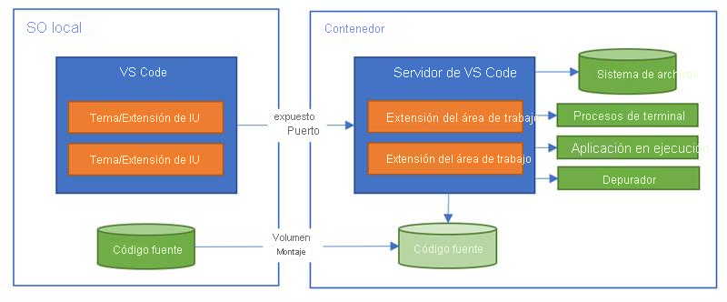

## Proyecto de desafío: Crear una aplicación de consola de minijuegos con GitHub Copilot

Demuestre su capacidad para analizar, crear y utilizar diferentes métodos para desarrollar un minijuego de consola en Python con GitHub Codespaces y GitHub Copilot.

Objetivos de aprendizaje
- Experimentar GitHub Codespaces como entorno de desarrollo.
- Desarrollar rutinas de entrada y salida en una aplicación de consola de Python.
- Usar GitHub Copilot como asistente.

Requisitos previos
- Una cuenta de GitHub y conocimientos básicos de los comandos de Git para ejecutar las rutinas (`add`, `commit and push`).
- Básico de Python para trabajar con variables, listas, bucles, condicionales e imprimir mensajes en la consola.

        Introducción
        5 min

        Preparación para el desafío
        5 min

        Ejercicio: Agregar la extensión GitHub Copilot
        10 min

        Ejercicio: Crear la lógica del juego
        10 min

        Prueba de conocimientos
        3 min

        Resumen
        2 min
___ 

## Ejercicio: Agregar la extensión GitHub Copilot

El objetivo es desarrollar una aplicación de minijuego de consola Python mediante GitHub Copilot. Como está trabajando en un Codespace, necesita instalar la extensión GitHub Copilot actualizando el archivo de configuración del contenedor de desarrollo.

#### ¿Qué es un contenedor de desarrollo?
Los contenedores de desarrollo son contenedores de Docker que están configurados para proporcionar un entorno de desarrollo completo. Siempre que trabaje en un codespace, estará usando un contenedor de desarrollo en una máquina virtual.

Puede configurar el contenedor de desarrollo para un repositorio y Codespaces puede crear un entorno de desarrollo a medida, con todas las herramientas y runtimes que necesita para trabajar en un proyecto específico.

En este diagrama de la *[documentación oficial de Visual Studio Code][5]* se muestra esta funcionalidad.

[5]: https://code.visualstudio.com/docs/remote/containers



#### Especificación
En este ejercicio de desafío, debe abrir la carpeta `devcontainer` y actualizar el archivo JSON `devcontainer.json` para agregar la extensión GitHub Copilot.

- Codespaces identifica las extensiones necesarias mediante su marketplace de Visual Studio Codeid.
- La identificación de la extensión GitHub Copilot es `GitHub.copilot`.

Al agregar la extensión GitHub Copilot a este archivo, se garantiza que está instalado en el contenedor de desarrollo y está disponible para su uso en Codespace.

#### Comprobar el trabajo
1. Acceda a Codespaces y abra el archivo app.py en Visual Studio Code.

2. Empiece a escribir el comentario:
``` py
# write 'hello world' to the console
```

2. GitHub Copilot debe completar el código. El resultado debería asemejarse al código siguiente:
``` py
# write 'hello world' to the console
print('hello world')
```

2. Ejecute la aplicación con el comando python app.py en el terminal y compruebe si el resultado es similar al siguiente mensaje de consola:
``` bash
hello world
```

Tras validar los resultados de este ejercicio, continúe con el siguiente ejercicio de este desafío.

___ 

## Ejercicio: Crear la lógica del juego

Con Codespaces configurado, el objetivo es desarrollar el minijuego de consola de Python. Debes crear la lógica del juego siguiendo las especificaciones y usar GitHub Copilot para ayudar a crear los métodos.

#### Especificación

- Reglas del juego:
    - La piedra gana a las tijeras (las rompe).
    - Las tijeras han ganado al papel (lo cortan).
    - El papel gana a la piedra (la envuelve).
    - El minijuego es multijugador y el equipo juega el papel del oponente y elige un elemento aleatorio de la lista de elementos

- Interacción con el jugador:
    - La consola se usa para interactuar con el jugador.
    - El jugador puede elegir una de las tres opciones: `rock`, `paper` o `scissors`.
    - El jugador puede elegir si vuelve a jugar.
    - Se debe advertir al jugador si introduce una opción no válida.
    - El jugador ve su puntuación al final del juego.

- Validación de la entrada del usuario:
    - En cada ronda, el jugador debe entrar en una de las opciones de la lista y ser informado de si ganó, perdió o empató con el oponente.
    - El minijuego debe controlar las entradas del usuario, colocarlas en minúsculas e informar al usuario si la opción no es válida.
    - Al final de cada ronda, el jugador debe responder si quiere jugar de nuevo o no.

Con Visual Studio Code en el explorador y GitHub Copilot para ayudarle, cree un minijuego que cumpla las especificaciones anteriores.

#### Comprobar el trabajo
1. Ejecute el minijuego en la consola con el comando python app.py.
2. En el símbolo del sistema, escriba una de las opciones del juego: rock, paper o scissors.
3. El minijuego debe informar al jugador de si ganó, perdió o empató con el oponente.
4. Elija para continuar jugando.
5. En el símbolo del sistema, escriba:screen.
6. El minijuego debe informar al jugador si la opción que ha especificado no es válida.
7. Repita los pasos 2 y 4 para jugar unas cuantas rondas y elija no seguir jugando.
8. Compruebe si el minijuego ha terminado y si muestra su puntuación, informándole del número de victorias y rondas.

Enhorabuena por completar este ejercicio de desafío. Ha creado un minijuego de consola de Python con GitHub Copilot.