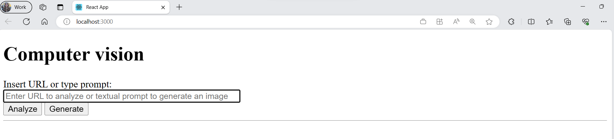
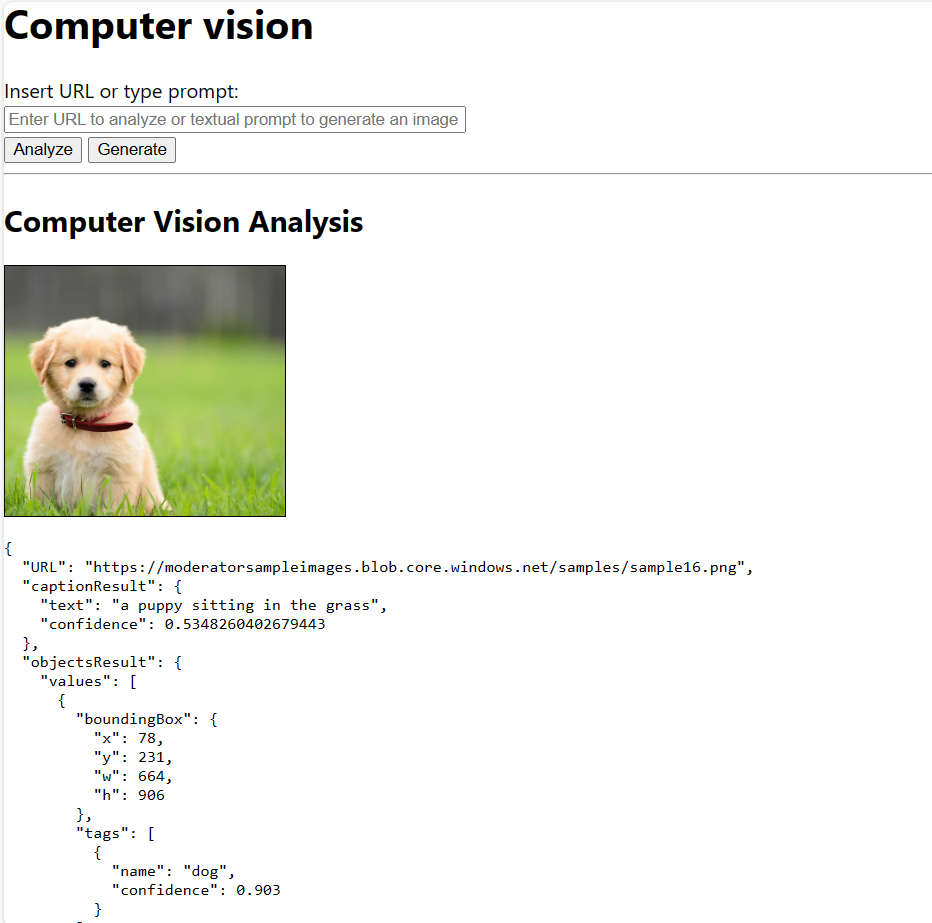
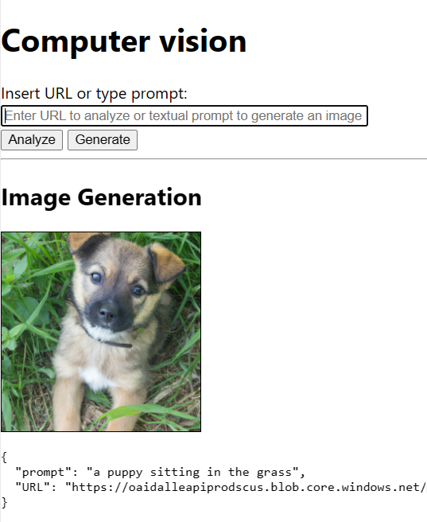
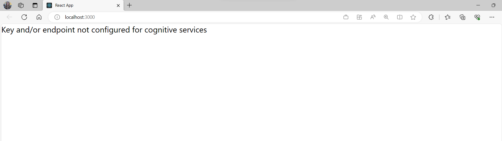
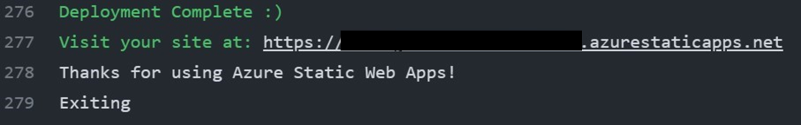

## Proyecto de desafío: agregar funcionalidades de generación y análisis de imágenes a la aplicación

Demostrar la capacidad de desarrollar una aplicación web inteligente que integre funcionalidades de Computer Vision, aprovechando Visión de Azure AI y los servicios cognitivos de Azure OpenAI.

    Nota:
    Este es un módulo Proyecto de desafío, en el que debe completar un proyecto de un extremo a otro con orientación genérica, sin instrucciones paso a paso.

Objetivos de aprendizaje
En este módulo, demostrará su capacidad para lo siguiente:

- Integrar en la aplicación las funcionalidades más recientes de Image Analysis 4.0 basadas en la tecnología del modelo básico a gran escala de Microsoft Florence.
- Enriquecer la solución con funcionalidades de inteligencia artificial generativa.
- Crear una canalización de CI/CD con acciones de GitHub para implementar la aplicación en la nube como una aplicación web estática de Azure.

Requisitos previos
- Experiencia con JavaScript y React o marcos similares.
- Experiencia con GitHub y Visual Studio Code.
- Conocimientos previos de las API de REST.

___

## Introducción

___

## Preparación
Para compilar la solución final, usará una combinación de diferentes servicios de Azure. Además, necesitará un IDE, como Visual Studio Code, para escribir, probar el código e implementarlo en la nube. En esta sección, obtendrá información sobre lo que necesita para configurar el entorno de desarrollo del proyecto.

#### Especificación del proyecto
El cliente le ha pedido que desarrolle una aplicación web que integre funcionalidades de Computer Vision sus empleados que puedan usar al desarrollar contenido nuevo. La aplicación permitirá a los usuarios analizar una imagen existente y generar una nueva a partir de una descripción de texto.

Usará los servicios cognitivos *[Visión de Azure AI][5]* y *[Azure OpenAI][6]* para implementar las funcionalidades necesarias. Además, usará el *[marco de React de JavaScript][7]* para desarrollar la aplicación web y *[Azure Static Web Apps][8]* para hospedarla en la nube y garantizar la integración y entrega continuas (CI/CD) del código.

[5]: https://learn.microsoft.com/azure/ai-services/computer-vision/overview?WT.mc_id=academic-105496-cacaste
[6]: https://learn.microsoft.com/azure/ai-services/openai/overview?WT.mc_id=academic-105496-cacaste
[7]: https://react.dev/
[8]: https://learn.microsoft.com/azure/static-web-apps/overview?WT.mc_id=academic-105496-cacaste

#### Configuración
Necesita una suscripción de Azure con Azure OpenAI habilitado para completar este desafío. Como parte del compromiso de Microsoft con la IA responsable, el acceso al servicio Azure OpenAI está limitado actualmente a un conjunto de clientes de Azure que lo solicitan por adelantado, rellenando *[este formulario][9]*. Si la aplicación no cumple los *[criterios de aceptación][10]*, puede utilizar las *[API públicas de OpenAI][11]* para compilar el prototipo. ¿No sabe cuál es la diferencia entre los dos servicios? Obtenga más información *[aquí][12]*.

[9]: https://customervoice.microsoft.com/Pages/ResponsePage.aspx?id=v4j5cvGGr0GRqy180BHbR7en2Ais5pxKtso_Pz4b1_xUOFA5Qk1UWDRBMjg0WFhPMkIzTzhKQ1dWNyQlQCN0PWcu
[10]: https://learn.microsoft.com/legal/cognitive-services/openai/limited-access?context=%2Fazure%2Fcognitive-services%2Fopenai%2Fcontext%2Fcontext&WT.mc_id=academic-105496-cacaste
[11]: https://platform.openai.com/docs/api-reference/introduction
[12]: https://learn.microsoft.com/azure/cognitive-services/openai/overview#comparing-azure-openai-and-openai/?WT.mc_id=academic-105496-cacaste

#### Requisitos previos
1. Cree una suscripción a Azure. Si es alumno, puede beneficiarse de una *[suscripción gratuita de Azure para alumnos][13]*. Si no es alumno, todavía puede registrarse para obtener una *[evaluación gratuita de Azure][14]*.
2. Instale Visual Studio Code, *[Node.js y npm][15]* para desarrollar y ejecutar la aplicación localmente.
3. Instale la *[extensión de VS Code Azure Static Web Apps][16]* y cree una cuenta de GitHub para implementar la aplicación en Azure Static Web Apps y configurar una canalización de CI/CD.

[13]: https://azure.microsoft.com/free/students/?WT.mc_id=academic-105496-cacaste
[14]: https://azure.microsoft.com/free/?WT.mc_id=academic-105496-cacaste
[15]: https://nodejs.org/
[16]: https://marketplace.visualstudio.com/items?itemName=ms-azuretools.vscode-azurestaticwebapps&WT.mc_id=academic-105496-cacaste

___ 

## Ejercicio: crear una aplicación web estática con React

Al completar este ejercicio, aprenderá a:

- Crear un nuevo recurso de Azure Static Web App en la suscripción junto con el esqueleto de la aplicación basado en el marco de JavaScript de React, mediante la extensión Visual Studio Code de Azure Static Web Apps.
- Cree una canalización de CI/CD para implementar la aplicación de React en Azure mediante el servicio de Azure Static Web Apps y las *[acciones de GitHub][17]*. La automatización del proceso de implementación es uno de los procedimientos recomendados clave recomendados por las *[directrices de DevOps][18]*, para detectar errores al principio y para asegurarse de que la aplicación siempre está actualizada.

[17]: https://github.com/features/actions 
[18]: https://learn.microsoft.com/devops/what-is-devops?WT.mc_id=academic-105496-cacaste

#### Especificación
Azure Static Web App publica un sitio web mediante la creación de una aplicación desde un repositorio de código. Cree un nuevo repositorio de GitHub mediante una *[plantilla][19]* que incluya una aplicación React de ejemplo. Asígnele el nombre "analyze-and-generate-images-with-Azure-AI" y clónelo localmente. Abra el repositorio clonado en Visual Studio Code y use la extensión Azure Static Web Apps para crear un nuevo recurso de Azure en la suscripción conectada con ese repositorio de GitHub, con "React" como valor preestablecido de compilación.

[19]: https://github.com/new?template_name=react-basic&template_owner=staticwebdev

#### Comprobar el trabajo
Para validar que ha creado correctamente la aplicación de React y la ha implementado en Azure Static Web App, abra la dirección URL de la aplicación en un explorador.

1. Para recuperar la dirección URL, haga clic en el icono de Azure en el menú Visual Studio Code, haga clic con el botón derecho en los recursos implementados recientemente y seleccione "Examinar sitio". Otra opción consiste en abrir el Azure Portal, ir al recurso y hacer clic en el vínculo "URL" en la sección "Información general".
2. Debería ver una página web con un mensaje "Hola mundo".

___

## Ejercicio: Diseñar la interfaz gráfica de usuario de la aplicación
Ahora que tiene el esqueleto básico de la aplicación de React, vamos a personalizarlo un poco, agregando una interfaz gráfica de usuario (GUI) sencilla, lo que permite al usuario interactuar con los modelos de Computer Vision.

#### Especificación
En el archivo App.js, limpie la función "App" de la plantilla y reemplácela por el código de javascript necesario para crear una GUI simple con los siguientes elementos:
- Un título
- Un cuadro de texto para escribir la dirección URL de la imagen que se va a analizar o la solicitud de imagen que se va a generar
- Un botón para desencadenar el análisis de imágenes y otro para desencadenar la generación de imágenes

En esta fase, aún no tiene el código back-end que controla las llamadas a los servicios de Azure AI, por lo que los botones aún no desencadenarán ninguna acción. Usted lo agregará en los ejercicios siguientes. Si lo desea, puede personalizar aún más la GUI agregando un archivo App.css y definiendo el estilo de los elementos de la página web.

    Sugerencia
    Puede usar los Enlaces de estado de React para habilitar la aplicación para que "recuerde" la entrada del usuario y la posición del cursor en el cuadro de texto.

#### Comprobar el trabajo
Para validar el trabajo que ha realizado en este ejercicio, ejecute la aplicación React localmente (mediante el comando `npm start`) y abra la dirección URL `http://localhost:3000` en un explorador. Debería ver una página web con un título, un cuadro de texto y dos botones, como el siguiente:

    Advertencia
    Es posible que reciba un error ERR_OSSL_EVP_UNSUPPORTED al ejecutar la aplicación localmente. Este mensaje de error indica que algo dentro de la pila de desarrollo web no es compatible con los archivos OpenSSL que está ejecutando. Para corregirlo, debe actualizar las herramientas de desarrollo (Node.js, React.js, etc.) a la versión más reciente. Encontrará una guía completa aquí. Si no desea actualizarlas por ningún motivo, simplemente puede habilitar el proveedor heredado OpenSSL 3.0 como solución alternativa, con el comando: set NODE_OPTIONS=--openssl-legacy-provider

    
    Sugerencia
    ¿Le gustaría tener un programador de pares de IA mientras codifica? Instale la extensión de Visual Studio de GitHub Copilot para obtener sugerencias insertadas.

___ 

## Ejercicio: agregar funcionalidades de análisis de imágenes a la aplicación React
En este ejercicio, agregará funcionalidades de análisis de imágenes a la aplicación React mediante el servicio cognitivo Azure AI Vision.

#### Especificación

1. Cree un nuevo recurso del servicio de Visión de Azure AI en su suscripción mediante el servicio "Computer Vision". Para ello puede aprovechar la interfaz de usuario de *[Azure Portal][20]* o la *[CLI de Azure][21]*.
[20]: https://ms.portal.azure.com/
[21]: https://learn.microsoft.com/cli/azure/what-is-azure-cli?WT.mc_id=academic-105496-cacaste

2. Agregue el código para llamar a la *[API de Image Analysis 4.0][22]* del servicio Visión de Azure AI a la aplicación React como una función "analyzeImage" en un nuevo módulo independiente, al que puede asignar el nombre "azure-image-analysis.js". Tenga en cuenta que puede personalizar las características visuales que va a devolver la API mediante la inserción en el parámetro de consulta "features". La función debe recibir como entrada la dirección URL de la imagen y devolver la respuesta JSON de la API.
[22]: https://learn.microsoft.com/azure/ai-services/computer-vision/how-to/call-analyze-image-40?tabs=rest&WT.mc_id=academic-105496-cacaste&pivots=programming-language-rest-api

3. Agregue "analyzeImage" como un nuevo módulo a la App.js y llame a la función "analyzeImage" desde allí, de forma que la acción de análisis de imágenes se desencadene cuando se presione el botón "Analizar". Asegúrese de contener la interfaz de usuario y de tener un indicador de procesamiento mientras se ejecuta el análisis.

4. En el archivo App.js, agregue una función "DisplayResults" para mostrar los resultados de la llamada API en un formato legible, junto con la dirección URL de la imagen procesada. 

       Sugerencia:
       No incluya la clave de los servicios directamente en el código ni la exponga nunca públicamente. Al ejecutar la aplicación localmente, puede almacenar las credenciales en variables de entorno. Las variables de entorno son pares nombre-valor que se almacenan en un entorno de desarrollo específico. Consulte el artículo sobre seguridad de servicios de Azure AI para obtener más opciones de autenticación. 

#### Comprobar el trabajo
Para validar el trabajo que ha realizado en este ejercicio, ejecute la aplicación React localmente (mediante el comando `npm start`) y abra la dirección URL `http://localhost:3000` en un explorador. Asegúrese de configurar las variables de entorno con la clave de servicio de Visión de Azure AI y la dirección URL del punto de conexión de antemano. Debería ver la misma GUI que en el ejercicio anterior, pero ahora, al escribir la dirección URL de una imagen y presionar el botón "Analizar", debería ver los resultados del servicio de análisis de imágenes mostrado en la página web, como en la imagen siguiente:

El json resultante puede cambiar en función de las características visuales que haya seleccionado en la llamada API. Use la característica "Caption" para obtener una sola descripción de oraciones de la imagen. Puede usar esta dirección URL pública para probar la aplicación: https://moderatorsampleimages.blob.core.windows.net/samples/sample16.png

___

## Ejercicio: Adición de funcionalidades de generación de imágenes a la aplicación React
En este ejercicio, agregará funcionalidades de generación de imágenes a la aplicación React mediante el servicio cognitivo Azure OpenAI y, en particular, el modelo DALLE2.

#### Especificación
1. Cree un nuevo recurso de Azure OpenAI Service en la suscripción. Para configurar el recurso correctamente, compruebe la disponibilidad regional del modelo DALLE2 antes de crearlo. Tenga en cuenta que, como parte del compromiso de Microsoft con la IA responsable, el acceso al servicio Azure OpenAI está limitado actualmente a un conjunto de clientes de Azure que lo soliciten por adelantado, rellenando este formulario. Si la solicitud no cumple los criterios de aceptación, puede utilizar las API públicas de OpenAI para compilar el prototipo.

2. Agregue el código para llamar a la API del servicio Azure OpenAI a la aplicación React como una función "generateImage" en un nuevo módulo independiente al que puede denominar "azure-image-generation.js". Tenga en cuenta que si usa un punto de conexión que no es de Azure, la autenticación y la construcción de puntos de conexión se lleva a cabo de forma diferente y debería consultar la referencia de la API de OpenAI.

3. Agregue "generateImage" como un nuevo módulo a App.js y llame a la función "generateImage" desde allí, de forma que la acción de generación de imágenes se desencadene cuando se presione el botón "Generar". Asegúrese de contener la interfaz de usuario y de tener un indicador de procesamiento mientras se ejecuta la acción.

4. En el archivo App.js, edite la función "DisplayResults" para mostrar los resultados de la llamada API, junto con la dirección URL de la imagen generada.

        Sugerencia
        No incluya la clave de los servicios directamente en el código ni la exponga nunca públicamente. Al ejecutar la aplicación localmente, puede almacenar las credenciales en variables de entorno. Las variables de entorno son pares nombre-valor que se almacenan en un entorno de desarrollo específico. Consulte el artículo sobre seguridad de servicios de Azure AI para obtener más opciones de autenticación.

#### Comprobar el trabajo
Para validar el trabajo que ha realizado en este ejercicio, ejecute la aplicación React localmente (mediante el comando `npm start`) y abra la dirección URL `http://localhost:3000` en un explorador. Asegúrese de configurar las variables de entorno con la clave de servicio de Azure OpenAI y la dirección URL del punto de conexión de antemano. Debería ver la misma GUI que en el ejercicio anterior, pero al introducir ahora un texto como entrada del cuadro de texto y pulsar el botón "Generar", debería ver la nueva imagen generada por el modelo DALLE2 de OpenAI, como en la imagen de abajo:

Puede usar el texto "Un cachorro sentado en el césped" para probar la aplicación.

___

## Ejercicio: comprobar la configuración de los servicios de Azure AI
Como se mencionó en ejercicios anteriores, si los servicios de Azure AI no están configurados con parámetros de autenticación (clave y punto de conexión) antes de ejecutar la aplicación, el back-end de la aplicación no funcionará correctamente. En este ejercicio:

- Agregue una comprobación para asegurarse de que la aplicación está configurada correctamente antes de ejecutarla.
- Agregue un mensaje de advertencia a la interfaz de usuario para informar al usuario de que la aplicación no está configurada correctamente.

#### Especificación
En los módulos js que creó para controlar las llamadas a los servicios de Azure AI ("azure-image-generation" y "azure-image-analysis"), agregue una función "isConfigured" para comprobar que las variables de entorno adecuadas se establecen para el servicio de IA. A continuación, importe las dos funciones en "App.js" y llámalas antes de representar la GUI. Si una de las dos funciones devuelve “false”, lo que significa que uno de los dos servicios de Azure AI no está configurado correctamente, muestre un mensaje de advertencia en la GUI, informando al usuario de que la aplicación no está configurada correctamente. De lo contrario, represente la GUI como de costumbre.

#### Comprobar el trabajo
Para validar el trabajo, quite las variables de entorno establecidas en los ejercicios anteriores para los servicios de Azure AI del entorno y ejecute la aplicación de React localmente (mediante el comando "npm start"). Debería ver un mensaje de advertencia como el siguiente:

___

## Ejercicio: Implementar una aplicación en Azure
Felicidades. La aplicación está lista y se ejecuta correctamente en el equipo local. En este último ejercicio, implementará la versión más reciente de la aplicación en la nube para que sea accesible para otros usuarios en distintos dispositivos a través de sus exploradores web. Usará Azure Static Web Apps para implementar la aplicación.

## Especificación
En el primer ejercicio, creó un flujo de trabajo de GitHub, conectando el repositorio de GitHub que hospeda el código al recurso de aplicación web estática de Azure en la suscripción. Ahora, para implementar los cambios de la aplicación en Azure, insertará el código en el repositorio de GitHub. Puede usar la compatibilidad integrada con Git en Visual Studio Code para hacerlo. Pero antes de eso, debe configurar los parámetros de autenticación para asegurarse de que la aplicación implementada pueda llamar correctamente a los servicios de Azure AI. Puede agregar la clave y el punto de conexión de los servicios de Visión de Azure AI y Azure OpenAI al repositorio de GitHub como *[secretos][30]*. A continuación, edite el archivo de flujo de trabajo de GitHub (hospedado en la carpeta ".github/workflows" de la solución) para permitir que la aplicación recupere los parámetros de autenticación de los secretos de Acciones de GitHub y asigne sus valores a las variables de entorno correspondientes. Por último, inserte el código en el repositorio de GitHub para desencadenar el flujo de trabajo e implementar la aplicación en Azure.

[30]: https://docs.github.com/en/actions/security-guides/encrypted-secrets#using-encrypted-secrets-in-a-workflow

#### Comprobar el trabajo
Vaya al repositorio de GitHub y haga clic en la pestaña "Acciones". Debería poder ver el flujo de trabajo de GitHub iniciado por la última confirmación en ejecución. Una vez completada la ejecución del flujo de trabajo, compruebe que haya finalizado con un estado correcto y expanda el trabajo "Compilar e implementar". Verá un registro similar al siguiente:

Haga clic en el enlace del sitio y pruebe la aplicación en la nube.

        Sugerencia

        Una vez que haya terminado, recuerde limpiar los recursos de Azure que creó en este desafío para evitar incurrir en costos inesperados.

___

## Prueba de conocimientos
1. Un desarrollador quiere insertar funcionalidades de análisis de imágenes en una aplicación web mediante la API de Image Analysis 4.0 basada en el modelo Florence de Microsoft Large Foundation. ¿Cuál de los pasos siguientes debe realizar el desarrollador para lograr este objetivo? 
- [ ] Cree un nuevo recurso del servicio Visión de Azure AI en Azure Portal mediante el servicio "Computer Vision".
- [ ] Cree un nuevo recurso del servicio Visión de Azure AI en Azure Portal mediante el servicio "Face".
- [ ] Cree un nuevo recurso del servicio Visión de Azure AI en Azure Portal mediante el servicio "Custom Vision".
<!-- Correcto. El servicio Computer Vision permite a los desarrolladores insertar funcionalidades de análisis de imágenes en sus aplicaciones. -->

2. Un desarrollador debe almacenar las credenciales del servicio OpenAI de Azure usadas por la aplicación para llamar a la API de forma segura. ¿Cuál de los pasos siguientes debe realizar el desarrollador para lograr este objetivo? 
- [ ] Use valores codificados de forma rígida en el código de la aplicación.
- [ ] Use variables de entorno para almacenar las credenciales.
- [ ] La opción más segura es evitar el almacenamiento de credenciales en cualquier lugar y, en su lugar, autenticarse a través de un token de acceso.
<!-- Correcto. Las variables de entorno son pares nombre-valor que se almacenan en un entorno de desarrollo específico. Se usan para pasar información de configuración a las aplicaciones que se ejecutan en el entorno. -->

3. Un desarrollador desea integrar los servicios de Azure AI en una aplicación web estática React. ¿Cuál de las siguientes afirmaciones es cierta? 
- [ ] Los servicios de Azure AI se pueden integrar mediante la creación de un componente que controla la autenticación y las llamadas al servicio Azure AI y, a continuación, a agregarlos al archivo "App.js".
- [ ] No es posible integrar los servicios de Azure AI en una aplicación web estática React.
- [ ] Los servicios de Azure AI se pueden integrar creando un componente que controla la autenticación y las llamadas al servicio Azure AI y, a continuación, a agregarlos al archivo "index.html".
<!-- Correcto. Los servicios de Azure AI se pueden integrar creando un componente que controla la autenticación y las llamadas al servicio Azure AI y, a continuación, a agregarlos al archivo "App.js". -->

___

## Resumen

Su desafío era desarrollar una aplicación web inteligente que integre funcionalidades de Computer Vision, aprovechando Visión de Azure AI y los servicios cognitivos de Azure OpenAI. Se le pidió que usara las características más recientes de Image Analysis 4.0, con tecnología del modelo de base grande de Florencia de Microsoft, para analizar una imagen existente y enriquecer la solución con funcionalidades de inteligencia artificial generativa para generar uno nuevo a partir de una descripción de texto. Finalmente, se le pidió crear una canalización de CI/CD con acciones de GitHub para implementar la aplicación en la nube como una aplicación web estática de Azure.